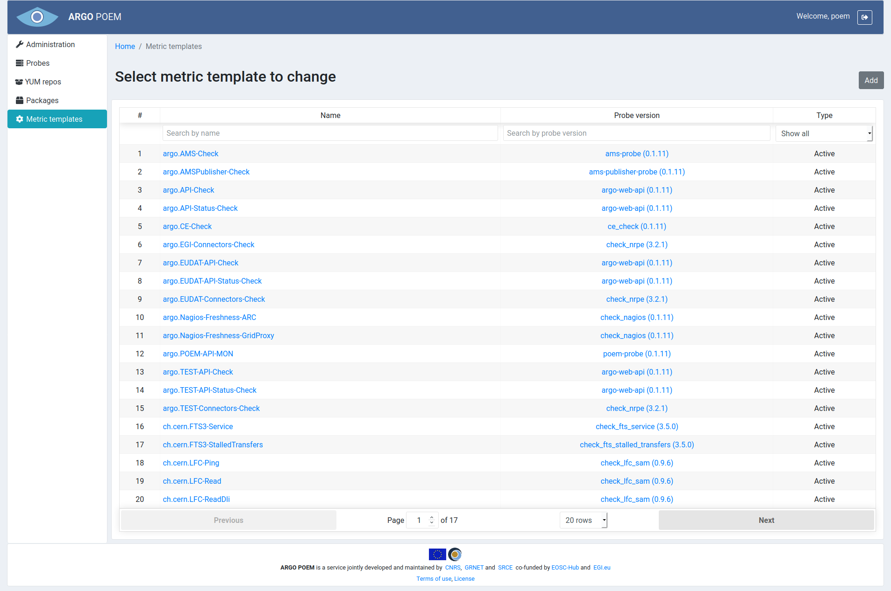
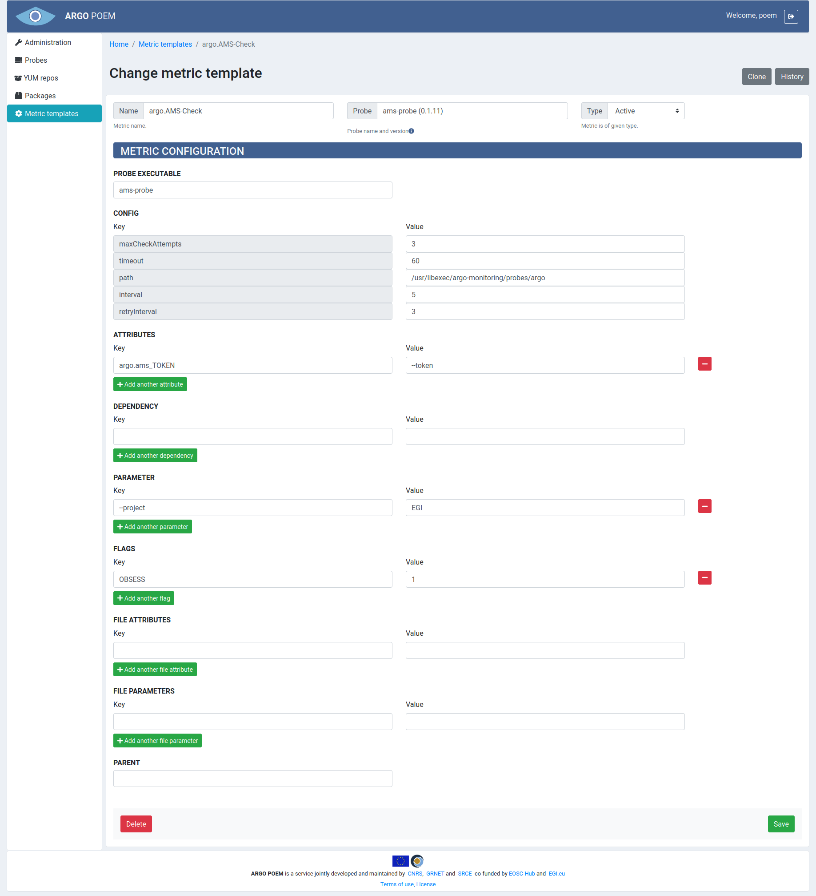
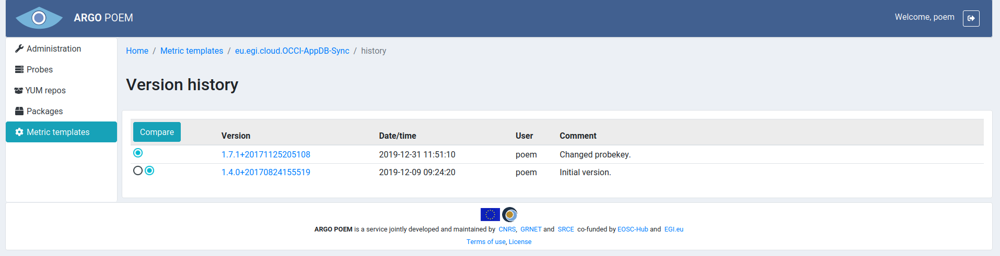

#Metric Templates
Metric templates page is accessible from the menu on the left side. The page is shown in the image below.

Metric templates may be filtered by name, probe, and tag (active or passive). By clicking on the metric template name, user can access particular metric template page. It is also possible to access particular probe version by clicking on its name.

Depending on metric template type, pages for particular metric templates are a bit different. Active metric template's page is shown in the image below.

Mandatory fields in case of active metric template:
* **Name** - metric template name;
* **Probe** - probe name and version. This field is autocomplete, user must choose from available probes;
* **Type** - type (active or passive; active in this example);
* **Probe executable** - executable file;
* **Config** - those defined 5 config fields are mandatory for active metrics.

Page for particular **passive** metric template is considerably reduced and it is shown in the image below.

Mandatory fields in case of passive metric template:
* **Name** - metric template name;
* **Type** - type (active or passive; passive in this example);
* **Flags** 
    * **PASSIVE** flag is mandatory for passive metrics - it is added automatically when passive type is chosen through the UI and it is disabled to prevent users from accidentally deleting it.
    
Metric template can be cloned by clicking **Clone** button. Then a new form is opened with fields filled with values as they are defined in source metric template.

By clicking **History** button, one may see all the versions of metric template as is shown in image below.

The user may see particular version of the metric template by clicking on its version, and see the differences between two versions by choosing the versions and clicking **Compare** button.
