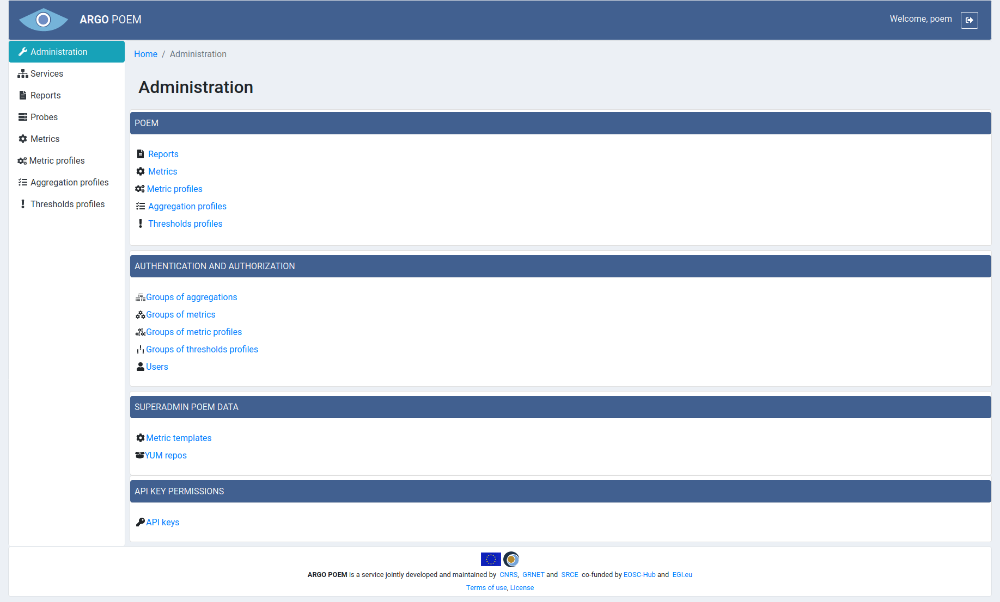

#Administration
Tenant POEM administration page is shown in the image below.

First section are links to component pages users are allowed to modify. They are all also accessible from the menu of the left side.

Second section, **Authentication and authorization**, is only available through Administration page, and therefore, only superusers can modify them.

Third section, **SuperAdmin POEM data**, are pages of read-only resources. They are set up through SuperAdmin POEM UI, and tenant users are not allowed to modify them.

In fourth section, **APIKey Permissions**, users are able to see API keys for tenant.
