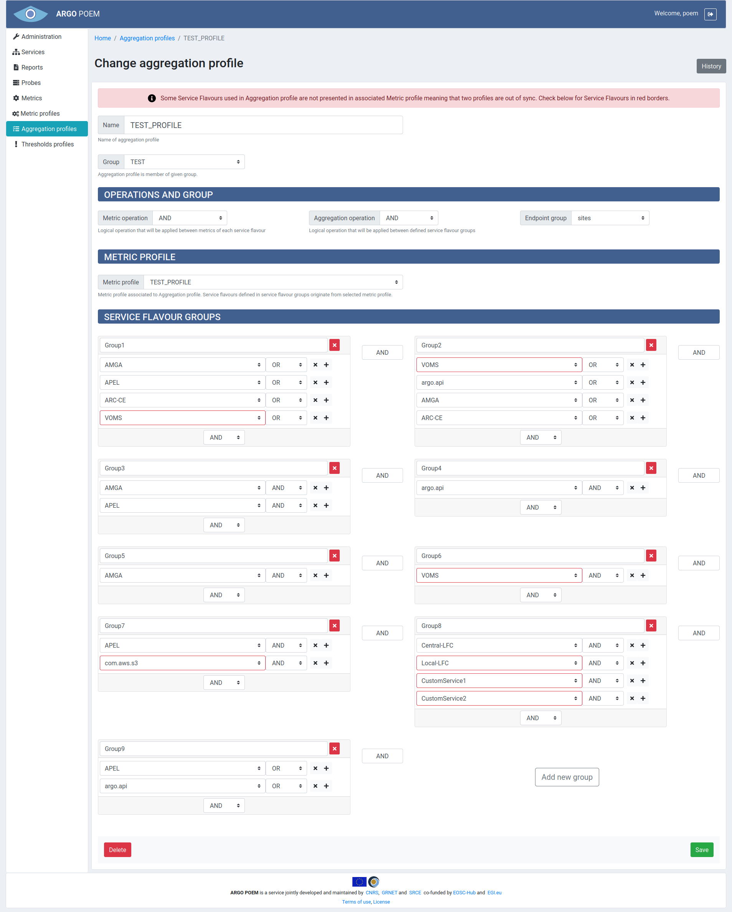

# Aggregation Profiles

## List of Aggregation Profiles

Aggregations profiles page is accessible from the menu on the left side. It is shown in the image below.

## Aggregation Profile Details

By clicking the profile name, the page of that particular profile is opened. Example is shown in the image below.

### Sections

The first part is the same for all the profiles: **Name** and **Group** fields. **Group** field is a drop down select field and it is required, so the group of aggregations must be created beforehand.

#### Operations and Group / Metric Profile

Sections **Operations and Group** and **Metric Profile** are all drop down select fields. The user can choose among the existing metric profiles. 

### Service Flavour Groups

In **Service Flavour Groups** section, the user can create new groups, and delete and modify the existing ones. For adding one uses buttons with "+" sign, for deleting buttons with "x" sign. Whole group is deleted by clicking the red "x" button.

There is a validation which checks if service flavours mentioned in aggregation profile exist in the associated metric profile, and if they do not, the warning message is displayed, and the missing service flavours are marked red (like shown in the image above).

Same as for other resources, only users with appropriate permission may modify aggregation profile. That is, users that have group of aggregation the profile belongs to assigned to them, or users with superuser permission.

### Aggregation Profile History

By clicking **History** button, user can see the changes made to the profile, the time they were made, and by whom they were made.
