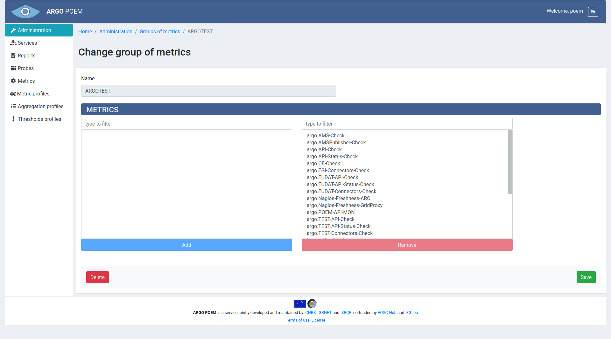
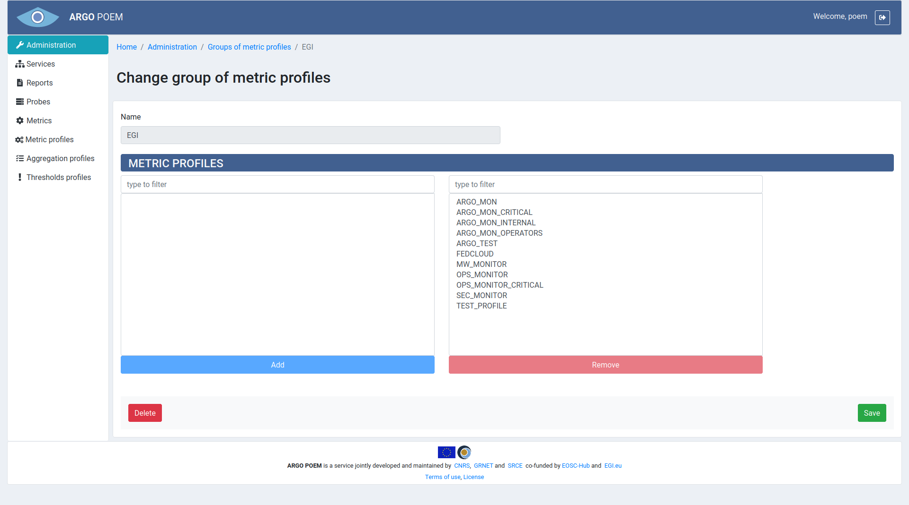
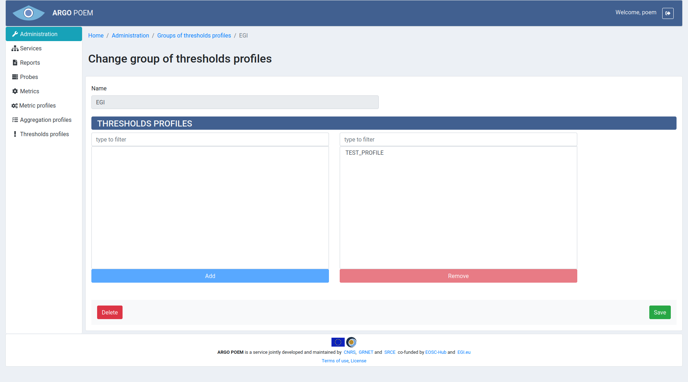

# Groups of Resources

All the groups of resources are available through Administration page. There are 4 groups of resources:

* Groups of aggregations,
* Groups of metrics,
* Groups of metric profiles,
* Groups of thresholds profiles.

All of the groups of resources pages look similar. By clicking the name of group, user opens page with details of that particular group of resource.

Once the page of the particular group of resource is opened, there are two sections. In the first section, the name is defined, and once it's defined, it is no longer possible to change it.

Second section consists of two windows. The left one shows the resources not assigned to any group. Among those resources, user can select those he wants to add to the group. The right one shows resources that belong to the group, and in that window, user may select the ones (s)he wants to remove from the group.

Images of groups of resources are shown below in respective sections.

## Group of Aggregations

## Group of Metrics

## Group of Metric Profiles

## Group of Thresholds Profiles

