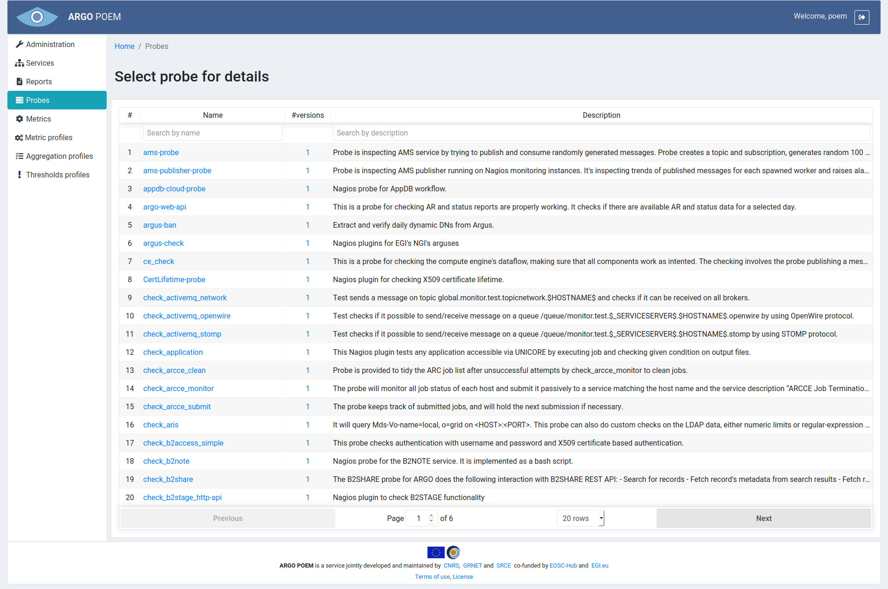
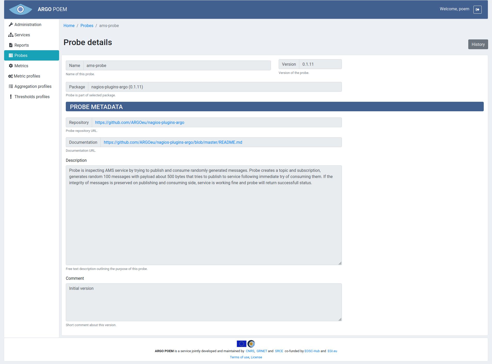

#Probes
Probes page is accessible through the menu on the left side. It is a read-only page where users may see probes' configurations. The page is shown in the image below.

Users may see details of particular probe by clicking on its name, or see all the available versions of probe by clicking on the number of versions. Probes can be searched by name or description.

Page of a particular probe is shown in the image below.

Tenant users are not allowed to modify probes. New probes are added only through SuperAdmin POEM, tenant users are only allowed to see probe info. By clicking **History** button, users can see all the available versions of the chosen probe.
