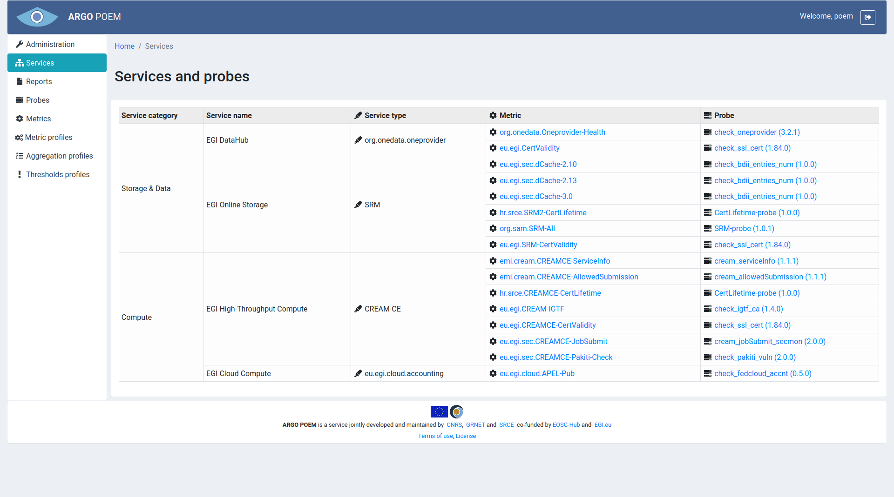

#Services
Services page is available for all logged in users from the menu on the left side. It is shown in the image below.

It is a read-only page where in a table services and associated metrics and probes for the tenant are given. The data is being automatically updated once an hour.
