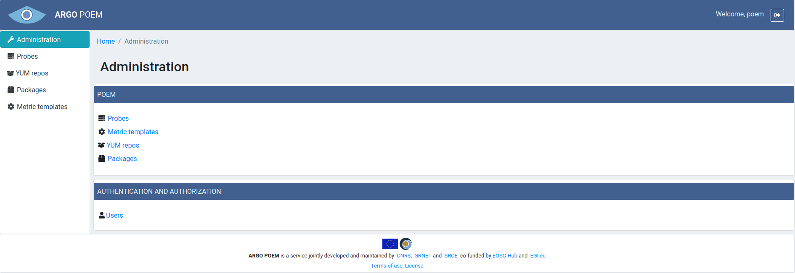

#Administration
SuperAdmin POEM Administration page is shown on the image below.

Administration page is only available to authenticated users with superuser status. The pages in the first card (Probes, Metric templates, YUM repos and Packages) are available to all users from the menu on the left side. Users page, on the other hand, is only available through Administration page. Only users with superuser status may add, change or delete users.
