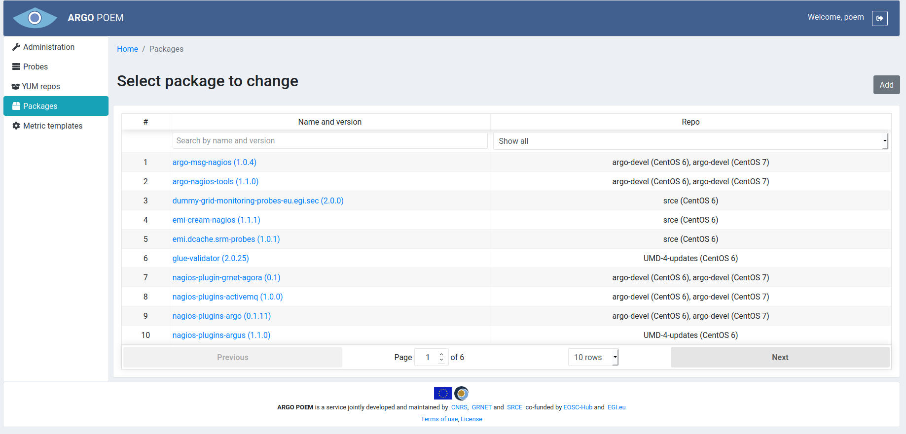
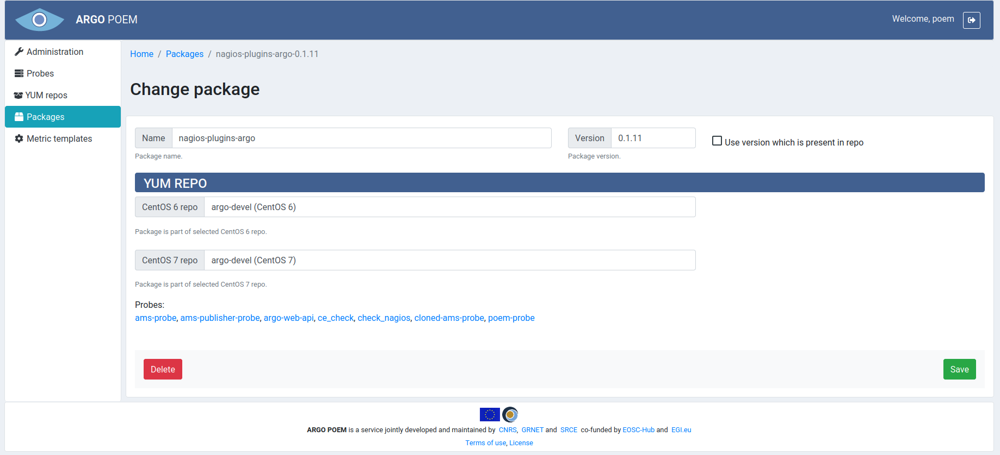

#Packages
Packages page is accessible from the menu on the left side. It is shown in the image below.

Packages can be filtered by choosing repo name from the drop down menu in **Repo** column, and by name by typing values in search bar on top of **Name and version** column. Page of each individual package is accessible by clicking name of package. The example page is shown in the image below.

Mandatory fields:
* **Name** - name of package;
* **Version** - version of package;
* **YUM repo** - **at least one** YUM repo must be defined; package can be part of both CentOS 6 and CentOS 7 repo:
    * **CentOS 6 repo** - repo tagged with CentOS 6 tag,
    * **CentOS 7 repo** - repo tagged with CentOS 7 tag.
    
If **Use version which is present in repo** is checked, package version is going to be tagged as present, and the version which exists in the repo is going to be installed on the monitoring box.

At the bottom of the page is shown the list of probes which are provided by the package and are defined in POEM.    
