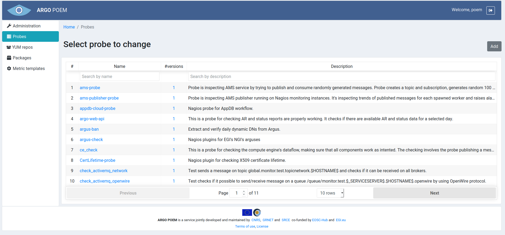

#Probe
Probe page is accessible from the menu on the left side. The page is shown in the image below. The list shows the name of the probe, number of available versions and short description.

By clicking the probe name, the user is redirected to the particular probe page (example shown in figure below).

All the fields but the checkbox are mandatory:
* **Name** - unique name of the probe; 
* **Version** - automatically filled from information on package (probe version is the same as the package version); 
* **Package** - autocomplete field where user may pick among the defined packages; 
* **Repository** - url for probe repository;
* **Documentation** - url for probe documentation;
* **Description** - text description describing the probe's purpose;
* **Comment** - free text comment on the probe's version.

If **Update metric templates** is checked, and probe version is changed, associated metric templates are going to automatically be updated to the newer version of the probe, and corresponding metric template history entries is going to be created.

At the bottom of the page is shown a list of metric templates associated to the chosen probe.

If **Clone** button is clicked, a new form is opened with fields filled according to the values in the probe being cloned. The version comment of probe created by cloning contains the name of the probe it was cloned from (example in figure below).

By clicking **History** button one can see all the available probe versions, as shown in the image below.

The user may see particular version of the probe by clicking on its version, and see the differences between two versions by choosing the versions and clicking **Compare** button.
