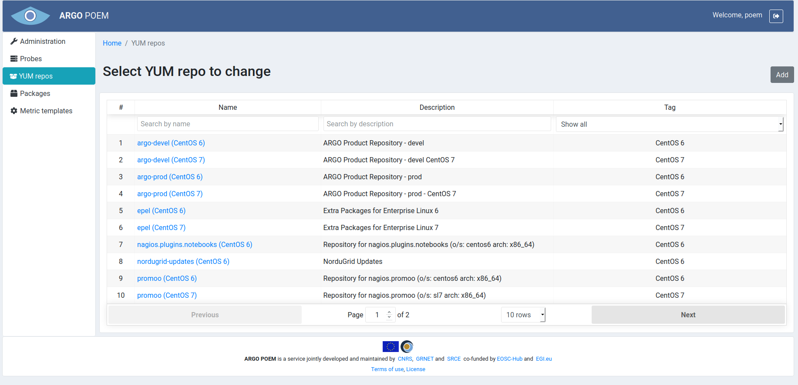
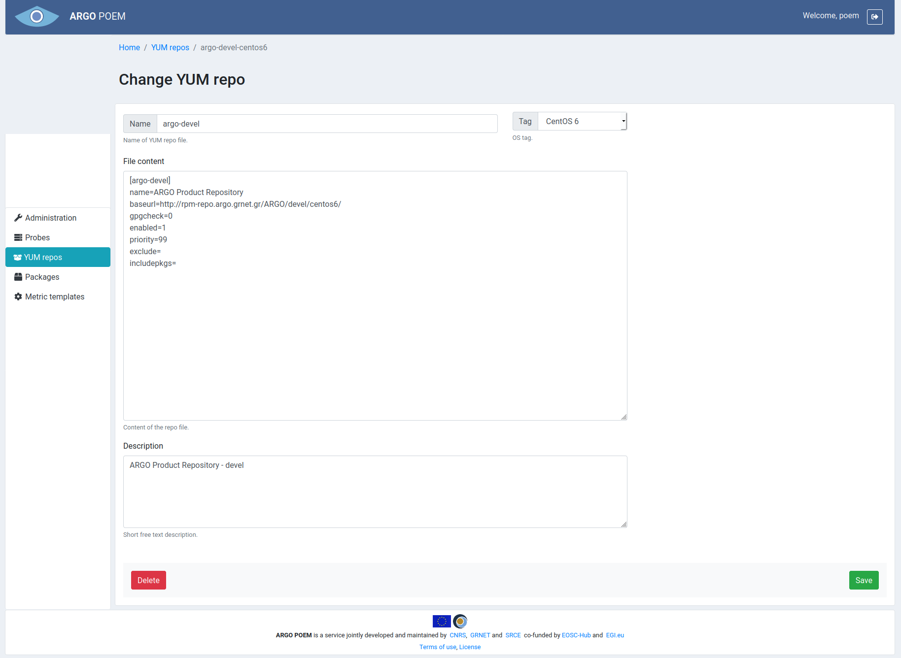

#YUM repos
YUM repos page is accessible from the menu on the left side. It is shown in the image below.

YUM repos may be filtered by OS tag. By clicking on the YUM repo name, user can access particular YUM repo page (shown on the image below). 

Mandatory fields:
* **Name** - name of YUM repo (without file extension);
* **Tag** - tag which marks for which OS the repo is defined:
    * CentOS 6,
    * CentOS 7;
* **File content** - content of the YUM repo file;
* **Description** - short free text description, shown in the YUM repo list.
