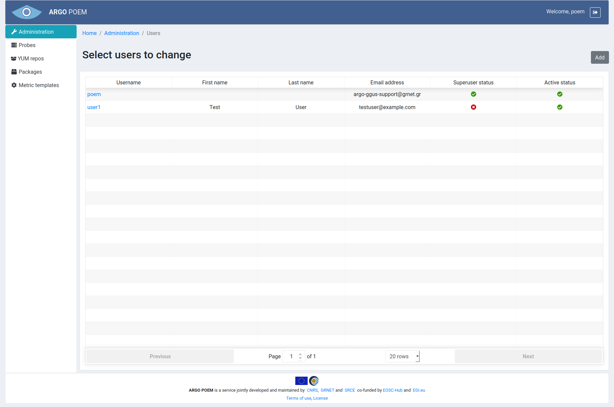
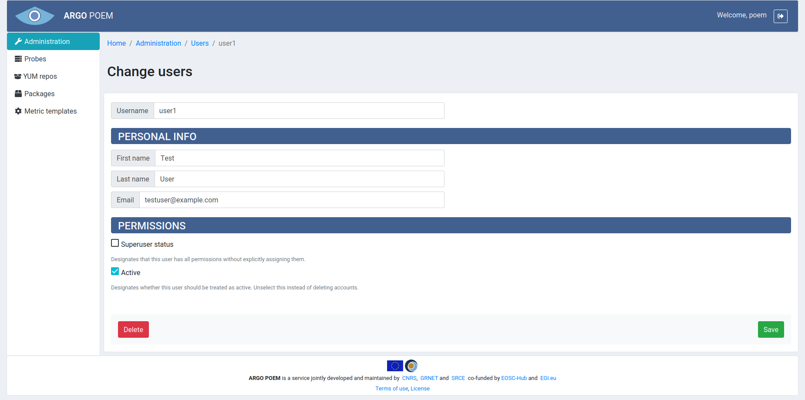
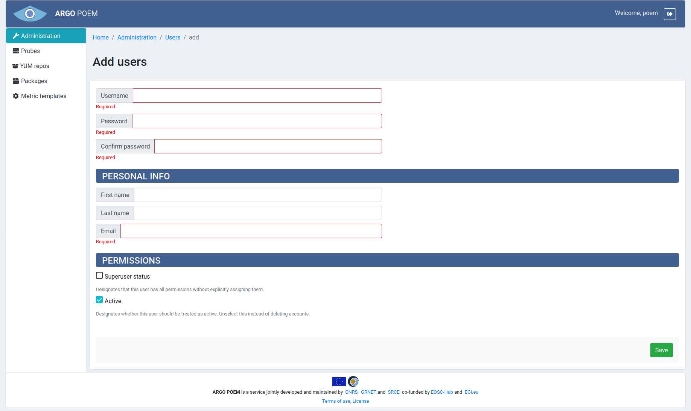

#Users
Users page is shown in the image below.

By clicking user's name, one can access its details, shown in the image below.

The first four fields are self-explanatory. There are three checkbox in Permissions section. First checkbox sets superuser status - only users with this permission can access Administration page and make changes to users. By removing Active status from user, that user is no longer able to log in to POEM.

When adding a new user (shown in the image below), there are 3 mandatory fields:
* **Username** 
    * must be 30 characters or fewer
    * can contain letters, numbers and @/./+/-/_ characters
* **Password**
    * must contain at least 8 characters
    * cannot be entirely numeric
    * Must match **Confirm password** field
* **Email**

