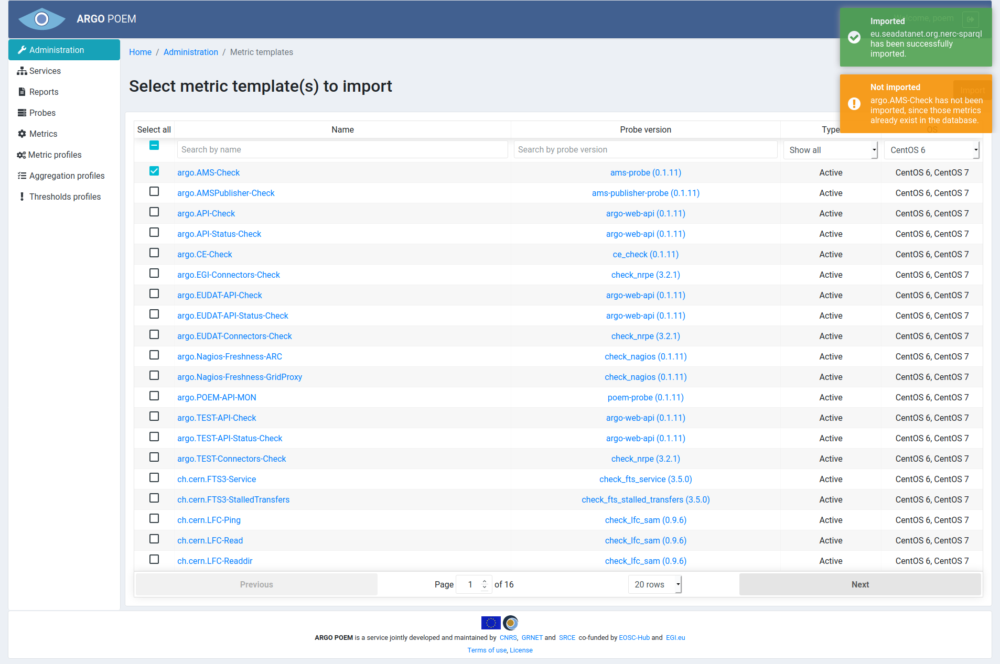

#Metric Templates
Metric templates page is only accessible through Administration page. It is used for importing metric from metric templates, and only superusers have necessary permissions to perform metric imports. The page is shown in image below.

The list shows all the available metric templates defined in POEM. User can select metric templates by clicking the checkbox next to its name, or select all metric templates by checking **Select all** checkbox. 

Before user can even start importing metrics, (s)he must choose OS. It is possible to choose between CentOS 6 and CentOS 7. It is the OS installed in tenant's monitoring box. When the appropriate OS is selected from the drop down menu, only metric templates available for that OS are shown.

Metric templates can then further be filtered by probe and type (active or passive).

Note that when metric templates are filtered by any condition, **Select all** checkbox selects only the filtered metric templates. For example, if the user filters metric templates by probe, say `check_http`, and (s)he checks **Select all**, metric templates associated to `check_http` probe are going to be selected.

Once the user selects all the metric templates (s)he wants to import as metrics, (s)he should press **Import** button. The user will then be notified if the import has been successful. The example in the image below shows the success and warning notification.

