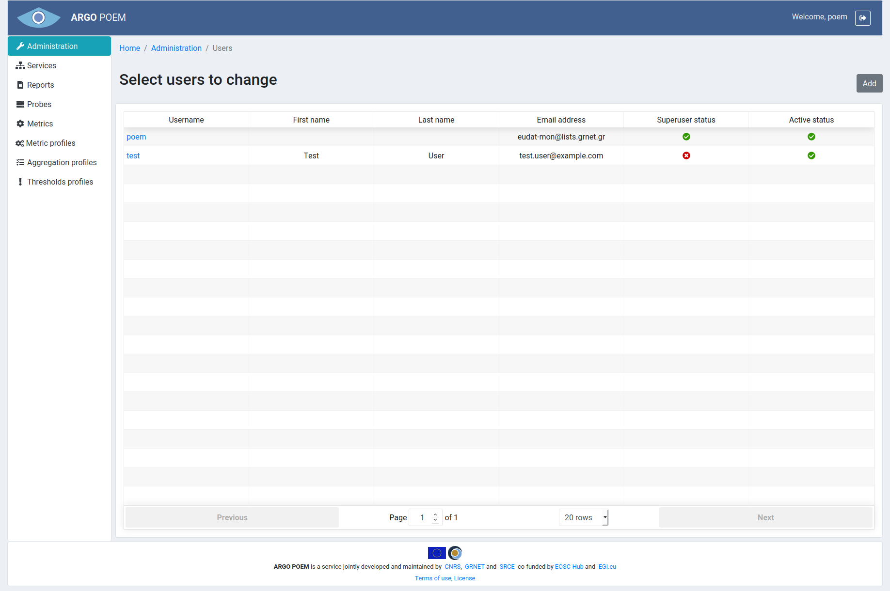
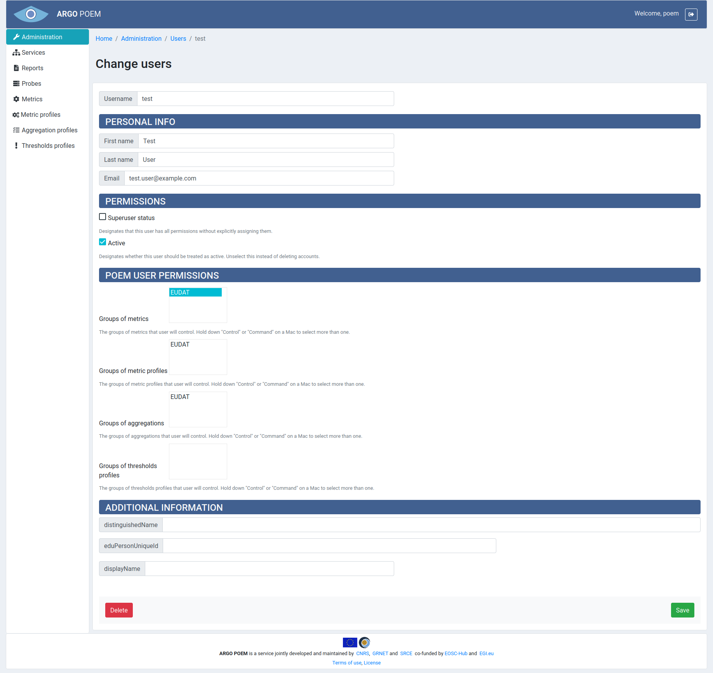

#Users
Users page is shown in the image below.

Only users with superuser status may modify users. By clicking on the name, users detail page is opened (example shown below).

The first four fields are self-explanatory. There are three checkbox in Permissions section. First checkbox sets superuser status - only users with this permission can access Administration page and make changes to users. By removing Active status from user, that user becomes inactive and is no longer able to log in to POEM.

Section **POEM User Permissions** contains groups of resources associated with the user. If a group is associated to the user, (s)he is allowed to modify the resources which belong to the group. In the shown example, Group of metrics EUDAT is associated to the user, therefore user has permission to modify all the metrics in the said group. If user is a superuser, he has permission to change all the resources, regardless of groups.

**Additional Information** section are information that are coming from the SAML IdP.
