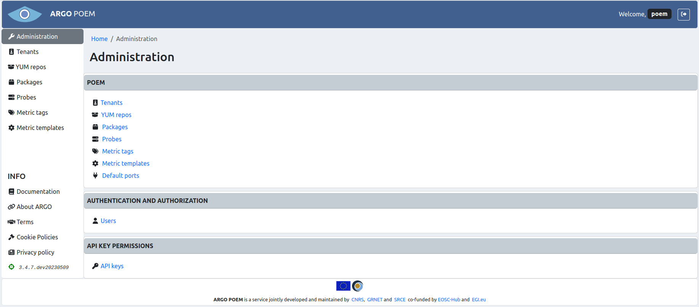

# Administration

SuperAdmin POEM Administration page is shown on the image below.

Administration page is only available to authenticated users with superuser status. 

## Sections

### POEM

The pages in the first section ([YUM repos](superadmin_repos.md), [packages](superadmin_packages.md), [probes](superadmin_probe.md), and [metric templates](superadmin_metric_templates.md)) are also available to all users from the menu on the left side. 

### Authentication and Authorization Page

[Users](superadmin_users.md) and API keys pages, on the other hand, are only available through **Administration** page. Only users with superuser status may add, change or delete users, or see or revoke API keys.
