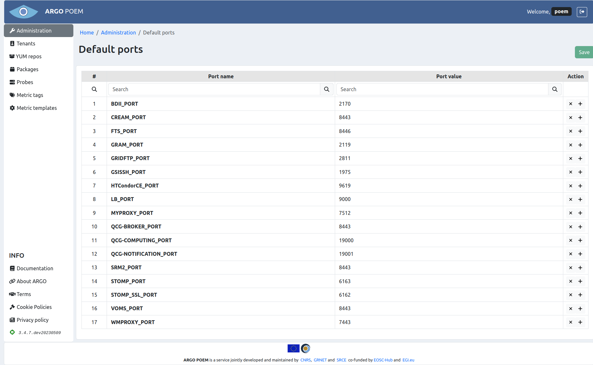

# Default ports

This page is accessible only from the [Administration](superadmin_administration.md) page. It lists the defined default values of some ports used by metric templates. The layout of the page is shown in figure below.

Entries can be removed by clicking on the `x` button in their respective rows. To save the changes to the DB, one must click on the `Save` button on top of the page. Note that the button is disabled in the figure, but it becomes enabled when the changes are made in the form.

New default port values may be added by clicking on any of the `+` buttons. When the name and value are entered, one must click on the `Save` button on top of the page (same as in case of removing the ports).
