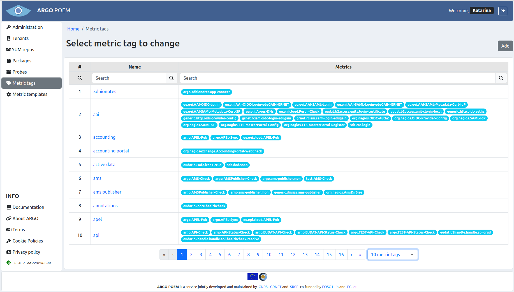
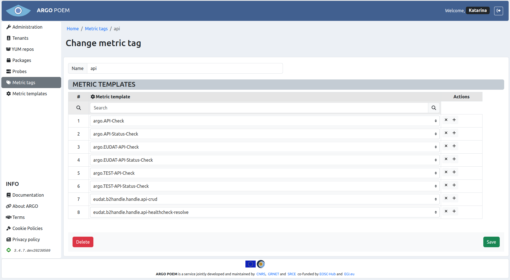
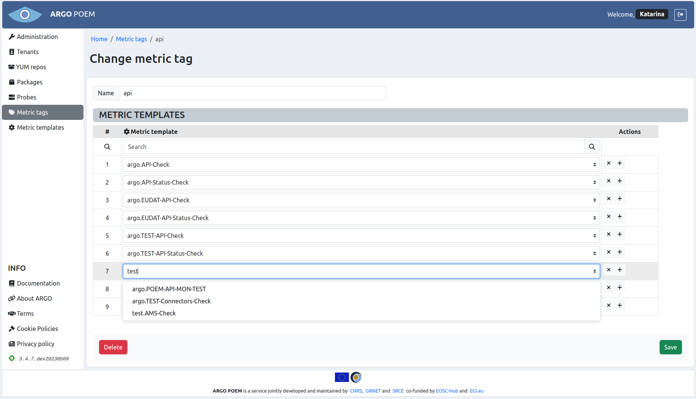

# Metric tags

## List of metric tags

Metric tags page is accessible from the menu on the left side. The page is simple, only showing the tag name, and the associated metrics. The layout is shown in figure below.

Metric tags may be filtered by name and by the metric associated with the tag.

## Metric tags' change view

In the change view (layout shown in figure below), one may change the tag name, and change the list of metrics associated with the tag.

The list of metrics is shown in the `Metric templates` section. In this section, the associated metric templates may be searched using the `Search` field on top of the section. Furthermore, for adding or removing metric templates from the list, one may use `+` and `x` buttons at the end of every row of table (`+` button is used for adding, `x` button is used for removing). When adding a new metric template, one gets a select field from which one may choose from existing metric templates (shown in figure below).

