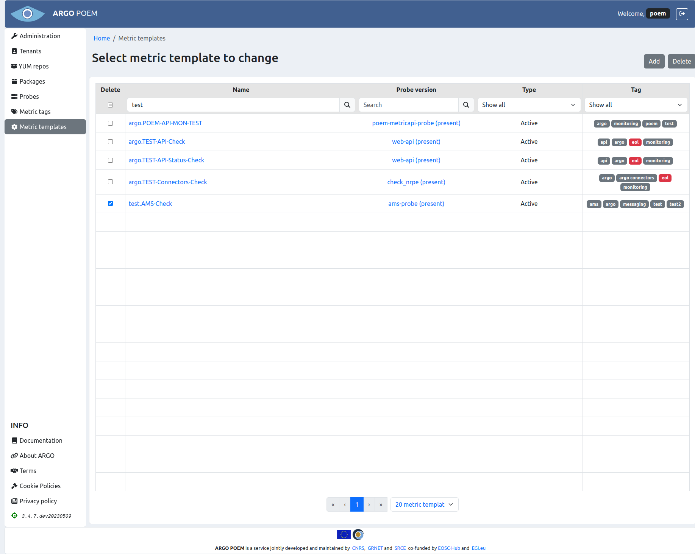
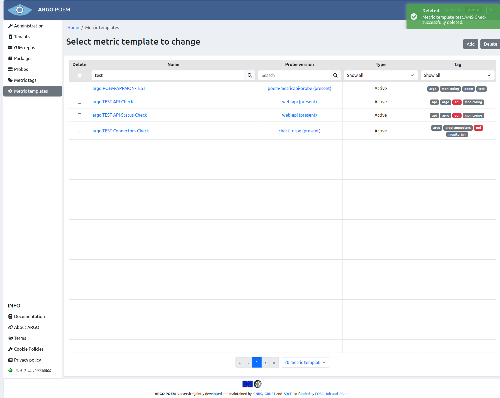

# Metric templates

## List of metric templates

Metric templates page is accessible from the menu on the left side. The page is shown in the image below.

Metric templates may be filtered by name, probe, type (active or passive), or tag. By clicking on the metric template name, user can access particular metric template's page. It is also possible to access particular probe version by clicking on its name.

There is also a feature to delete multiple metric templates at once. For that, user may select metrics (s)he wishes to delete from POEM, and click on **Delete** button (shown in figure below). 

User will then be asked if (s)he is sure (s)he wants to delete selected metrics. Once the user confirms his/her selection, metric templates and their histories are deleted. Metrics imported to tenants and their histories are also deleted, and they are removed from metric profiles. User will be informed of successful deletion of metric templates (figure below). Also, in case of any error, user will be informed the same way.

## Metric template details

Depending on metric template type, pages for particular metric templates are a bit different. Active metric template must have a probe assigned to it, while passive metric template does not.

### Active metric templates

Active metric template's page is shown in the image below.

#### Field descriptions
Mandatory fields in case of active metric template:

* **Name** - metric template name;
* **Probe** - probe name and version. This field is autocomplete, user must choose from available probes;
* **Type** - type (active or passive; active in this example);
* **Tag** - tag;
* **Probe executable** - executable file;
* **Config** 
    * **maxCheckAttempts** - used to define the number of times that Nagios will retry the service check command if it returns any state other than an OK state; setting this value to 1 will cause Nagios to generate an alert without retrying the service check again;
    * **timeout** - timeout (in seconds) for probe,
    * **path** - path to executable file,
    * **interval** -  used to define the time (in minutes) to wait before scheduling the next "regular" check of the service; "regular" checks are those that occur when the service is in an OK state or when the service is in a non-OK state, but has already been rechecked **maxCheckAttempts** number of times;
    * **retryInterval** - used to define the time (in minutes) to wait before scheduling a re-check of the service; services are rescheduled at the retry interval when they have changed to a non-OK state; once the service has been retried **maxCheckAttempts** times without a change in its status, it will revert to being scheduled at its "normal" rate as defined by the **interval** value.

##### Tags

Metric templates can be tagged by any tag. There are, however, three tags that are special. So-called internal metrics are tagged with *internal* tag. Those metrics are checking internal processes which are necessary for all tenants. They are automatically imported to a tenant POEM once new tenant is created.

Metric templates tagged with *deprecated* or *eol* tag are no longer being maintained, and are not used actively.

Tag field is a multiple select field with autocomplete and a possibility to create new entries. So, when SuperAdmin user starts typing, all the already existing tags are listed (filtered by the letters typed-in). If the desired tag does not exist, user can create new one by simply clicking *create entry*.

##### Attributes

Attributes are part of metric template definition. They are used to pass values as arguments to metric command (e.g. TCP port on which service is listening, SE path, CE queue...). 

Description of attributes is given in the table below.

| Attribute                   | Description                                                                                                                                                         |
|-----------------------------|---------------------------------------------------------------------------------------------------------------------------------------------------------------------|
| `AGORA_PASSWORD`            | Password for Agora Catalogue service.                                                                                                                               |
| `AGORA_USERNAME`            | Username for Agora Catalogue service.                                                                                                                               |
| `ARC_CE_MEMORY_LIMIT`       | Memory limit used by jobs in bytes for ARC-CE metrics.                                                                                                              |
| `ARC_GOOD_SES`              | Value of ARC_GOOD_SES variable for ARC-CE metrics.                                                                                                                  |
| `ARC_NAGIOS_SERVICE`        | ARC metric being used to check Nagios freshness.                                                                                                                    |
| `ARGOUI_AR_PATH`            | Path used for checking the ARGO UI A/R report availability.                                                                                                         |
| `ARGOUI_AR_REGEX`           | Regex used for checking the ARGO UI A/R report availability.                                                                                                        |
| `ARGOUI_STATUS_PATH`        | Path used for checking the ARGO UI status report availability.                                                                                                      |
| `ARGOUI_STATUS_REGEX`       | Regex used for checking the ARGO UI A/R report availability.                                                                                                        |
| `ARGO_AMS_PROJECT`          | Project name used for checking the ARGO AMS availability.                                                                                                           |
| `ARGO_AMS_TOKEN`            | Token for authentication against ARGO AMS.                                                                                                                          |
| `ARGO_API_TOKEN`            | Token for authentication against ARGO Web-API.                                                                                                                      |
| `ARGO_OIDC_SP_URL`          | URL of the Service Provider's AUTHENTICATION link for OIDC.                                                                                                         |
| `ARGO_SAML_SP_URL`          | URL of the Service Provider's AUTHENTICATION link for SAML.                                                                                                         |
| `ARGO_STATUS_URL`           | URL of endpoint containing service status.                                                                                                                          |
| `ARGO_TENANTS_TOKEN`        | POEM token(s) for ARGO tenant(s).                                                                                                                                   |
| `ARGO_WEBDAV_OPS_URL`       | WebDAV URL containing also the VO ops folder.                                                                                                                       |
| `ARGO_WEBDAV_SKIP_DIR_TEST` | Use this flag to skip the directory listing test for WebDAV.                                                                                                        |
| `ARGO_WEBODV_SECRET`        | Token for authentication against WebODV service.                                                                                                                    |
| `ARGO_XML_XPATH`            | XPath to check in the XML response.                                                                                                                                 |
| `ARGO_XML_XPATH_OK_VALUE`   | XPath value which will return OK status when checking XML response.                                                                                                 |
| `ARGO_XROOTD_OPS_URL`       | XRootD base SURL to test (the path where ops VO has write access).                                                                                                  |
| `ARGUS_SALT`                | Salt for the dynamic DN from Argus                                                                                                                                  |
| `B2HANDLE_PREFIX`           | B2HANDLE prefix.                                                                                                                                                    |
| `B2STAGE_API_PASSWORD`      | Password for B2STAGE.                                                                                                                                               |
| `B2STAGE_API_USERNAME`      | Useername for B2STAGE.                                                                                                                                              |
| `BDII_PORT`                 | BDII port.                                                                                                                                                          |
| `BDII_DN`                   | BDII base DN                                                                                                                                                        |
| `BROKER_PORT`               | Broker port.                                                                                                                                                        |
| `CREAM_PORT`                | CREAM CE port.                                                                                                                                                      |
| `CREAM_QUEUE`               | CREAM CE queue for a given VO.                                                                                                                                      |
| `CVMFS-Stratum-1_PORT`      | CVMFS-Stratum-1 port.                                                                                                                                               |
| `EDUGAIN_PASSWORD`          | EDUGAIN password.                                                                                                                                                   |
| `EDUGAIN_USER`              | EDUGAIN username.                                                                                                                                                   |
| `EGISSO_PASSWORD`           | EGI SSO password.                                                                                                                                                   |
| `EGISSO_USER`               | EGI SSO username.                                                                                                                                                   |
| `EOSCCORE_HELPDESK_TOKEN` | Token for EOSCCORE helpdesk API.                                                                                                                                    |
| `FTS_PORT`                  | FTS port.                                                                                                                                                           |
| `GITLAB_URL_SECRET` | Gitlab URL containing token.                                                                                                                                        |
| `GLUE2_BDII_DN` | GLUE2 LDAP base.                                                                                                                                                    |
| `GRAM_PORT`                 | GRAM Gatekeeper port.                                                                                                                                               |
| `GRIDFTP_PORT`              | GridFTP port.                                                                                                                                                       |
| `GRIDPROXY_NAGIOS_SERVICE` | GRIDPROXY metric being used to check Nagios freshness                                                                                                               |
| `GSISSH_PORT` | GSISSH port.                                                                                                                                                        |
| `HOSTDN` | Host DN.                                                                                                                                                            |
| `KEYCLOAK_CLIEND_ID` | Client ID for Keycloak service.                                                                                                                                     |
| `KEYCLOAK_CLIENT_SECRET` | Client secret for Keycloak service.                                                                                                                                 |
| `KEYSTORE`                  | Location of Java keystore with host certificate. Default value is `/etc/nagios/globus/keystore.jks`.                                                                
| `LB_PORT` | LB port.                                                                                                                                                            |
| `MYPROXY_NAME` | Name of MyProxy credential to use.                                                                                                                                  |
| `MYPROXY_PORT`              | MYPROXY port.                                                                                                                                                       |
| `MYPROXY_SERVER` | Name or IP address of MyProxy host to check.                                                                                                                        |
| `MYPROXY_USER` | Name of MyProxy account under which the credential was stored.                                                                                                      |
| `NAGIOS_B2ACCESS_LOGIN` | B2ACCESS username.                                                                                                                                                  |
| `NAGIOS_B2ACCESS_PASSWORD` | B2ACCESS password.                                                                                                                                                  |
| `NAGIOS_FRESHNESS_PASSWORD` | Nagios password.                                                                                                                                                    |
| `NAGIOS_FRESHNESS_USERNAME` | Nagios username.                                                                                                                                                    |
| `NAGIOS_HOST_CERT`          | Location of host certificate with nagios user ownership. Value is `/etc/nagios/globus/hostcert.pem`.                                                                |
| `NAGIOS_HOST_KEY`           | Location of host certificate key with nagios user ownership. Value is `/etc/nagios/globus/hostkey.pem`.                                                             |
| `NAGIOS_UI_CREDENTIALS` | Credentials for Nagios UI.                                                                                                                                          |
| `OCCI_PORT` | OCCI port.                                                                                                                                                          |
| `OIDC_ACCESS_TOKEN` | OIDC access token.                                                                                                                                                  |
| `OIDC_CLIENT_ID` | OIDC client ID.                                                                                                                                                     |
| `OIDC_CLIENT_SECRET` | OIDC client secret.                                                                                                                                                 |
| `OIDC_REFRESH_TOKEN` | OIDC refresh token.                                                                                                                                                 |
| `OS_APPDB_IMAGE` | OpenStack AppDB image.                                                                                                                                              
| `OS_KEYSTONE_HOST` | OpenStack Keystone host.                                                                                                                                            |
| `OS_KEYSTONE_PORT` | OpenStack Keystone port.                                                                                                                                            |
| `OS_KEYSTONE_URL` | OpenStack Keystone URL.                                                                                                                                             |
| `OS_REGION` | OpenStack region.                                                                                                                                                   |
| `PATH`                      | Path extracted from URL.                                                                                                                                            |
| `PORT`                      | Port extracted from URL.                                                                                                                                            |
| `PROXY_LIFETIME` | Lifetime of generated proxy in hours.                                                                                                                               |
| `QCG-BROKER_PORT` | QCG Broker port.                                                                                                                                                    |
| `QCG-COMPUTING_PORT` | QCG Computing port.                                                                                                                                                 |
| `QCG-NOTIFICATION_PORT` | QCG Notification port.                                                                                                                                              |
| `RM_PORT` | RM port.                                                                                                                                                            |
| `ROBOT_CERT` | Location of robot certificate.                                                                                                                                      |
| `ROBOT_KEY` | Location of robot certificate key.                                                                                                                                  |
| `SENSU_HOST_CERT` | Location of certificate used by Sensu.                                                                                                                              |
| `SE_PATH`                   | Storage element path for a given VO.                                                                                                                                |
| `<serviceType>_URL`         | URL extracted topology database (e.g. GOCDB attribute URL); serviceType prefix is used in order to avoid collision in case of multiple serviceTypes on a same host. |
| `SITE_BDII`                 | Hostname of Site BDII.                                                                                                                                              |
| `SITENAME`                  | Site name.                                                                                                                                                          |
| `SRM1_PORT`                 | SRM1 port.                                                                                                                                                          |
| `SSH_PORT` | SSH port.                                                                                                                                                           |
| `SSL`                       | Attribute is set if URL scheme is `https://`.                                                                                                                       |
| `SURL` | SRM base SURL to test.                                                                                                                                              |
| `TOP_BDII`                  | Hostname of Top BDII used for generating configuration.                                                                                                             |
| `TRUSTSTORE`                | Location of Java truststore with all IGTF CA bundle. Default value is `/etc/nagios/globus/truststore.ts`.                                                           |
| `URL`                       | URL extracted topology database (e.g. GOCDB attribute URL).                                                                                                         |
| `VOMS_PORT` | VOMS port.                                                                                                                                                          |
| `VONAME` | VO name.                                                                                                                                                            |
| `VO_FQAN` | VO FQAN.                                                                                                                                                            | 
| `WMPROXY_PORT`              | WMPROXY port.                                                                                                                                                       |
| `X509_USER_PROXY` | Location of x509 certificate proxy file. |

##### Flags

Flags are part of metric definition and control how the metrics are configured on the mon-box. Below is description currently
supported flags.

| Flag | Description |
|------|-------------|
| `NOHOSTNAME` | Metric's command is configured without -H parameter. |
| `NOTIMEOUT` | Metrics command is configured without -t parameter. |
| `NRPE` | Metric is configured to be executed via NRPE on service node. |
| `NOPUBLISH` | Metric results are not published to AMS. |
| `PASSIVE` | If defined, metric is part of a complex check. NCG configures metric as passive check only. Results for the metric should be generated by parent metric or received via message bus. |
| `VO` | Metric is VO dependent. Metric is configured multiple time for each VO or VO FQAN defined. In case that VO is not supported on a given host, metric is not generated at all. |

### Passive metric templates

Page for particular **passive** metric template is considerably reduced, and it is shown in the image below.

Mandatory fields in case of passive metric template:

* **Name** - metric template name;
* **Type** - type (active or passive; passive in this example);
* **Flags** 
    * **PASSIVE** flag is mandatory for passive metrics - it is added automatically when passive type is chosen through the UI and it is disabled to prevent users from accidentally deleting it.
    
### Metric template cloning

Metric template can be cloned by clicking **Clone** button. Then a new form is opened with fields filled with values as they are defined in source metric template.

### Metric template history

By clicking **History** button, one may see all the versions of metric template as is shown in image below.

The user may see particular version of the metric template by clicking on its version, and see the differences between two versions by choosing the versions and clicking **Compare** button.
