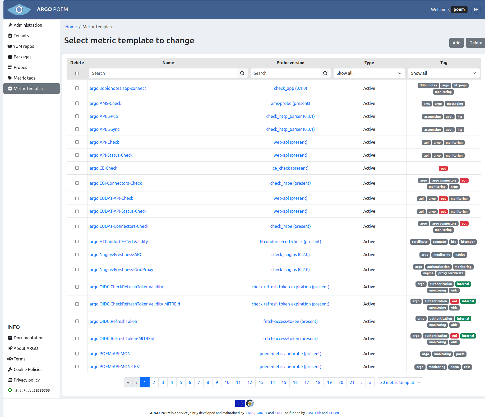
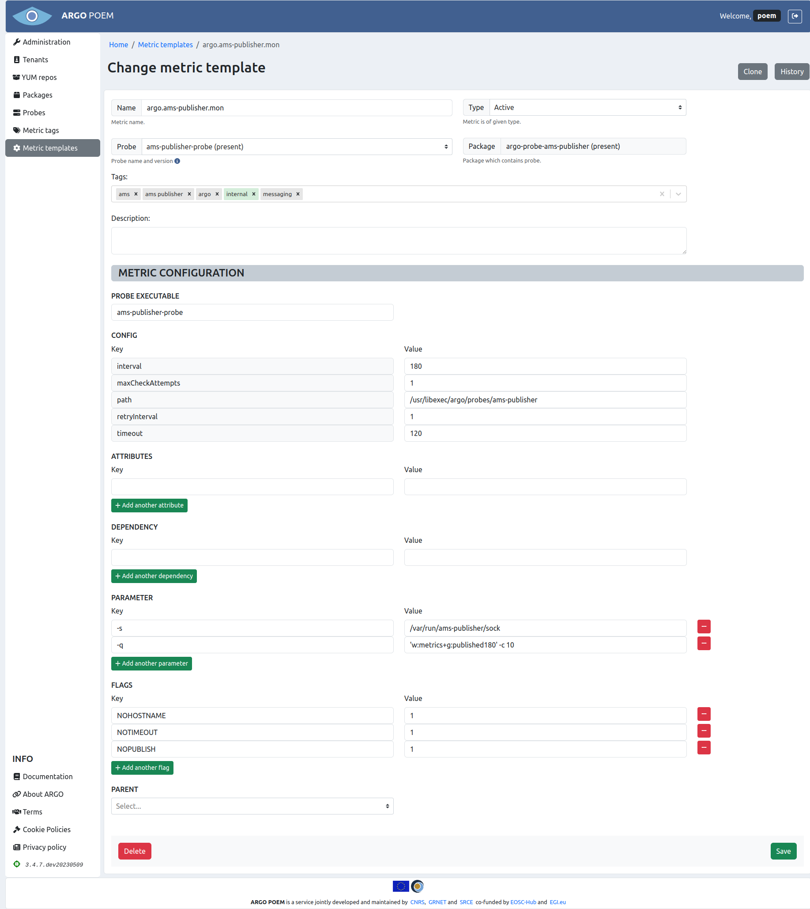
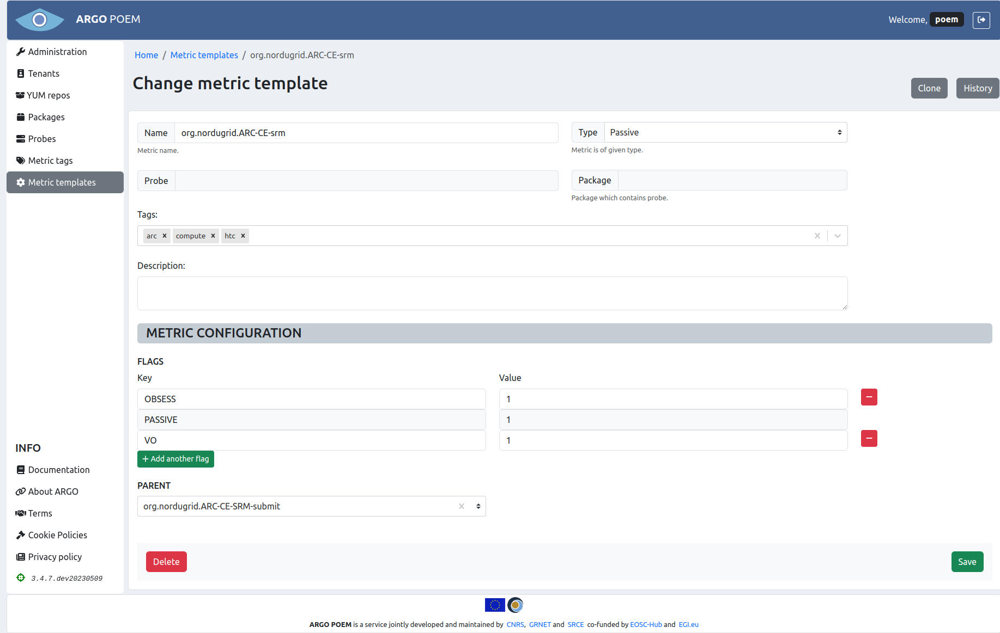
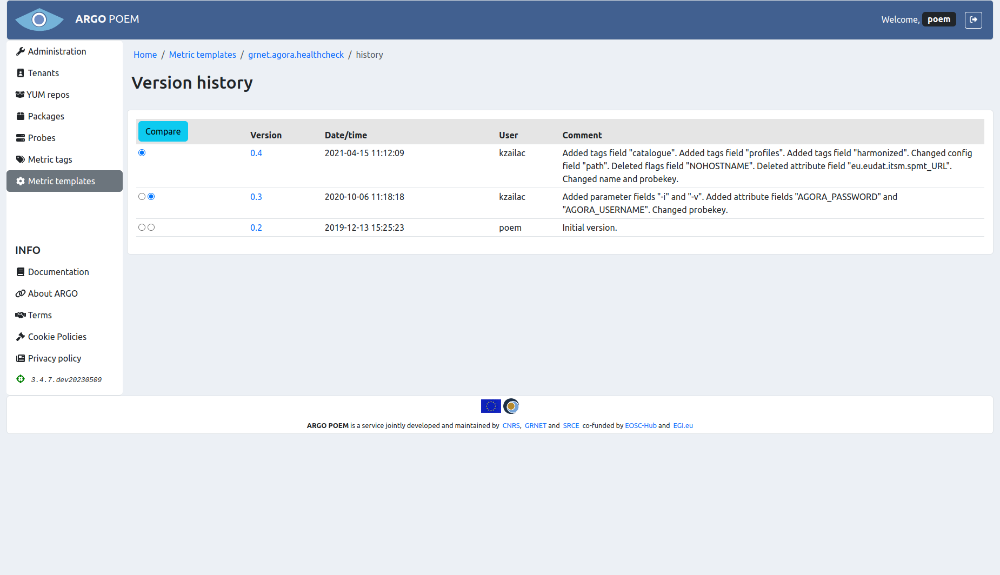

# Metric Templates

## List of Metric Templates

Metric templates page is accessible from the menu on the left side. The page is shown in the image below.

Metric templates may be filtered by name, probe, and tag (active or passive). By clicking on the metric template name, user can access particular metric template page. It is also possible to access particular probe version by clicking on its name.

## Metric Template Details

Depending on metric template type, pages for particular metric templates are a bit different. Active metric template must have a probe assigned to it, while passive metric template does not.

### Active Metric Templates

Active metric template's page is shown in the image below.

Mandatory fields in case of active metric template:

* **Name** - metric template name;
* **Probe** - probe name and version. This field is autocomplete, user must choose from available probes;
* **Type** - type (active or passive; active in this example);
* **Probe executable** - executable file;
* **Config** 
    * **maxCheckAttempts** - used to define the number of times that Nagios will retry the service check command if it returns any state other than an OK state; setting this value to 1 will cause Nagios to generate an alert without retrying the service check again;
    * **timeout** - timeout (in seconds) for probe,
    * **path** - path to executable file,
    * **interval** -  used to define the time (in minutes) to wait before scheduling the next "regular" check of the service; "regular" checks are those that occur when the service is in an OK state or when the service is in a non-OK state, but has already been rechecked **maxCheckAttempts** number of times;
    * **retryInterval** - used to define the time (in minutes) to wait before scheduling a re-check of the service; services are rescheduled at the retry interval when they have changed to a non-OK state; once the service has been retried **maxCheckAttempts** times without a change in its status, it will revert to being scheduled at its "normal" rate as defined by the **interval** value.

#### Attributes

Attributes are part of metric template definition. They are used to pass values as arguments to metric command (e.g. TCP port on which service is listening, SE path, CE queue...). 

Description of attributes is given in the table below.

| Attribute | Description |
|-----------|-------------|
| `BDII_PORT` | BDII port. |
| `BDII_DN` | BDII base DN |
| `BDII_TYPE` | Type of BDII, can be one of the following: `bdii_top` and `bdii_site`. |
| `CREAM_PORT` | CREAM CE port. |
| `CREAM_QUEUE` | CREAM CE queue for a given VO. |
| `FTS_PORT` | FTS port. |
| `GRIDFTP_PORT` | GridFTP port. |
| `GRAM_PORT` | GRAM Gatekeeper port. |
| `HOST_NAME` | Hostname of the monitored box. Do not use this attribute for parameter `-H` because it is set automatically. |
| `KEYSTORE` | Location of Java keystore with host certificate. Default value is `/etc/nagios/globus/keystore.jks`.
| `LL_PORT` | LocalLogger port. |
| `MYPROXY_PORT` | MYPROXY port. |
| `NAGIOS_HOST_CERT` | Location of host certificate with nagios user ownership. Value is `/etc/nagios/globus/hostcert.pem`. |
| `NAGIOS_HOST_KEY` | Location of host certificate key with nagios user ownership. Value is `/etc/nagios/globus/hostkey.pem`. |
| `PATH` | Path extracted from URL. |
| `PORT` | Port extracted from URL. |
| `RGMA_PORT` | RGMA port. |
| `SE_PATH` | Storage element path for a given VO. |
| `<serviceType>_URL` | URL extracted topology database (e.g. GOCDB attribute URL); serviceType prefix is used in order to avoid collision in case of multiple serviceTypes on a same host. |
| `SITE_BDII` | Hostname of Site BDII. |
| `SITENAME` | Site name. |
| `SRM1_PORT` | SRM1 port. |
| `SRM2_PORT` | SRM2.2 port. |
| `SSL` | Attribute is set if URL scheme is `https://`. |
| `TOMCAT_PORT` | TOMCAT port. |
| `TOP_BDII` | Hostname of Top BDII used for generating configuration. |
| `TRUSTSTORE` | Location of Java truststore with all IGTF CA bundle. Default value is `/etc/nagios/globus/truststore.ts`. |
| `URL` | URL extracted topology database (e.g. GOCDB attribute URL). |
| `VOBOX_PORT` | VOBOX port. |
| `WMPROXY_PORT` | WMPROXY port. |

#### Flags

Flags are part of metric definition and control how the NCG configures metric. Below is description currently
supported flags.

| Flag | Description |
|------|-------------|
| `NOARGS` |  Metric's command is configured without arguments. |
| `NOHOSTNAME` | Metric's command is configured without -H parameter. |
| `NRPE_SERVICE` | Metric is configured to be executed via NRPE on service node. |
| `NOPUBLISH` | Metric results are not published to AMS. |
| `PASSIVE` | If defined, metric is part of a complex check. NCG configures metric as passive check only. Results for the metric should be generated by parent metric or received via message bus. |
| `VO` | Metric is VO dependent. Metric is configured multiple time for each VO or VO FQAN defined. In case that VO is not supported on a given host, metric is not generated at all. |

### Passive Metric Templates

Page for particular **passive** metric template is considerably reduced and it is shown in the image below.

Mandatory fields in case of passive metric template:

* **Name** - metric template name;
* **Type** - type (active or passive; passive in this example);
* **Flags** 
    * **PASSIVE** flag is mandatory for passive metrics - it is added automatically when passive type is chosen through the UI and it is disabled to prevent users from accidentally deleting it.
    
### Metric Template Cloning

Metric template can be cloned by clicking **Clone** button. Then a new form is opened with fields filled with values as they are defined in source metric template.

### Metric Template History

By clicking **History** button, one may see all the versions of metric template as is shown in image below.

The user may see particular version of the metric template by clicking on its version, and see the differences between two versions by choosing the versions and clicking **Compare** button.
