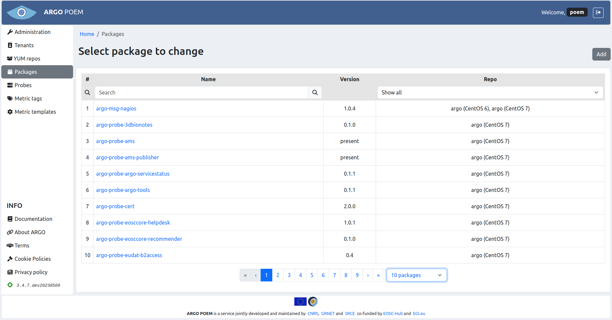
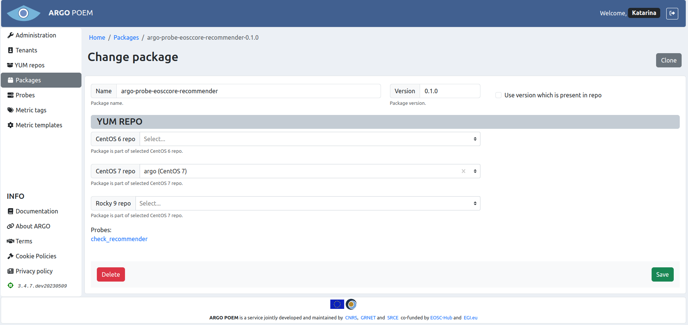

# Packages

Packages are `.rpm` packages which provide probes. 

## List of packages

The page is accessible from the menu on the left side. It is shown in the image below.

Packages can be filtered by choosing repo name from the drop down menu in **Repo** column, and by name by typing values in search bar on top of **Name** column. 

## Package details

Page of each individual package is accessible by clicking name of package. The example page is shown in the image below.

### Fields
Mandatory fields:
* **Name** - name of package (as defined in `.rpm` file);
* **Version** - version of package (as defined in `.rpm` file);
* **YUM repo** - **at least one** YUM repo must be defined; YUM repo which provides the given package:
    * **CentOS 6 repo** - repo tagged with CentOS 6 tag,
    * **CentOS 7 repo** - repo tagged with CentOS 7 tag.
    * **Rocky 9 repo** - repo tagged with Rocky 9 tag.
    
If the **Use version which is present in repo** is checked, package version is going to be tagged as present, and the version which exists in the repo is going to be installed on the monitoring box.

### List of probes provided by the package

At the bottom of the page is shown the list of probes which are provided by the package and are defined in POEM.    
