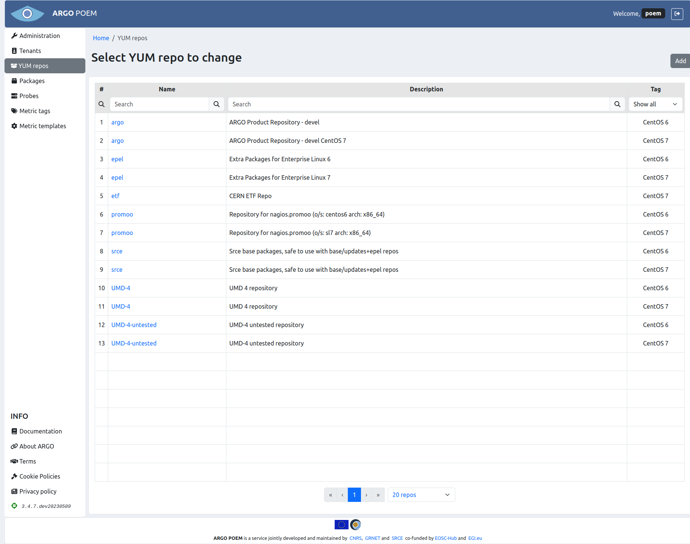
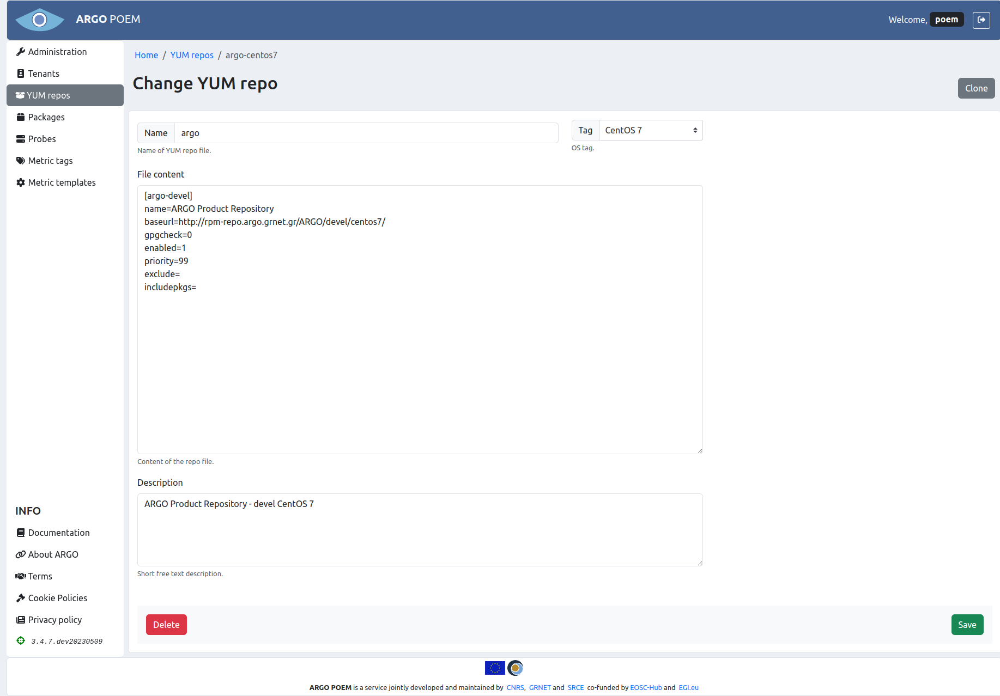

# YUM repos

## List of YUM repos

YUM repos page is accessible from the menu on the left side. It contains list of YUM repos which contain packages which contain probes. It is shown in the image below.

## YUM repo details
 
YUM repos are defined for particular OS, and they can be filtered by OS tag. By clicking on the YUM repo name, user can access particular YUM repo page (shown on the image below). 

### Fields

All the fields are mandatory:

* **Name** - name of YUM repo (**without** `.repo` file extension);
* **Tag** - tag which marks for which OS the repo is defined:
    * CentOS 6,
    * CentOS 7;
* **File content** - content of the YUM repo file;
* **Description** - short free text description, shown in the YUM repo list.
