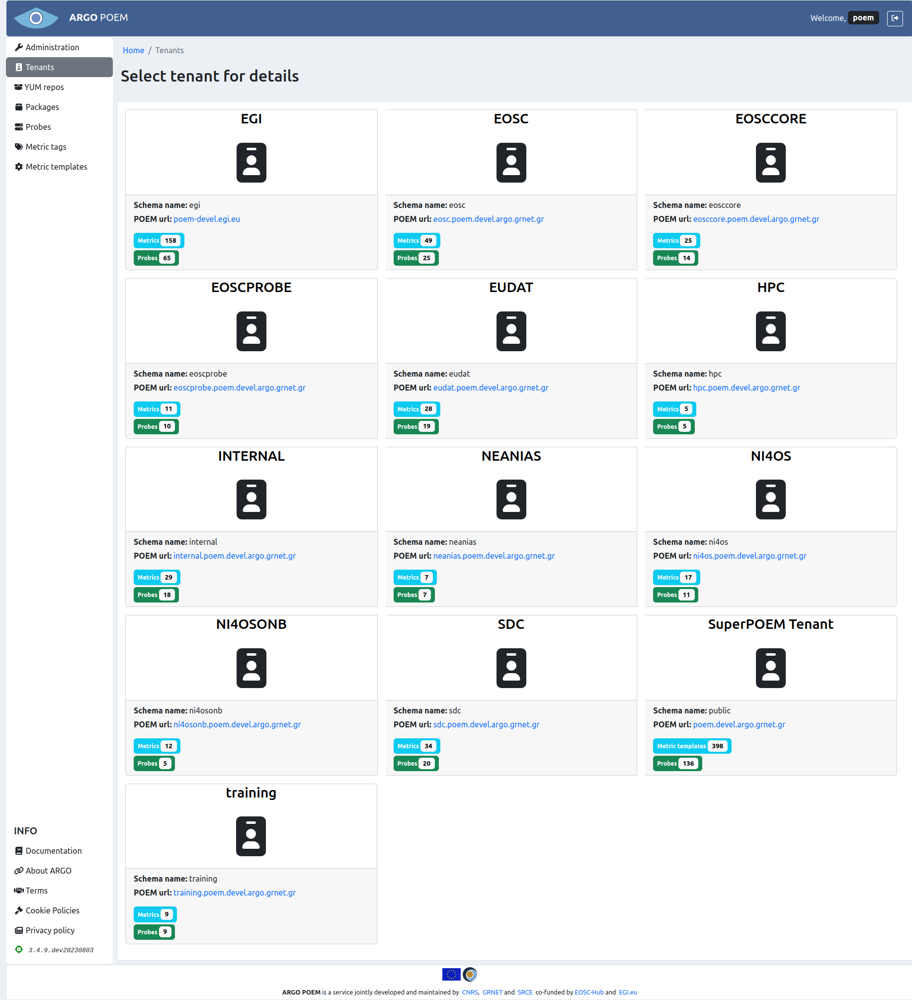
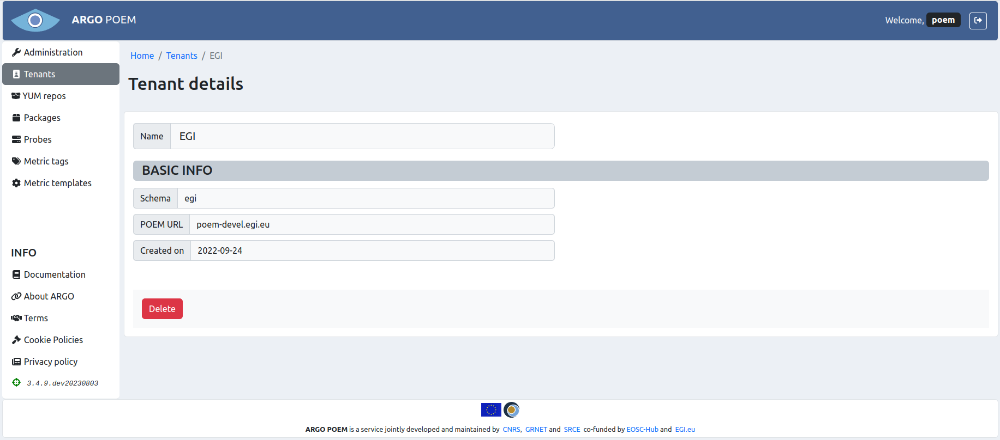

# Tenants

Tenant page is accessible from the menu on the left side. It is shown in the image below. 

The figure shows main info on each tenant: Postgres DB schema name, POEM url, and total number of probes and metrics used by the given tenant. There is also so called **SuperPOEM tenant** which is not a technically a tenant. Information given on the SuperPOEM tenant probes and metrics refers to the total number of probes and metric templates given in POEM.

Clicking on the tenant card opens the tenant details page.

## Tenant details

Tenant details page is shown in the image below.

In addition to the information given in the tenant list page, this one also gives information on the date when the chosen tenant has been created. All the fields are disabled, since this is only an info page.

There is also a **Delete** button, which will delete the particular tenant, along with its Postgres schema.
