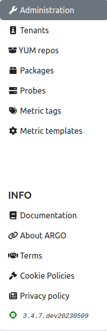
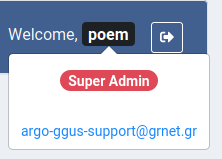

# User interface

When the user is logged into SuperAdmin POEM, (s)he is redirected to [Administration page](superadmin_administration.md). 

On the left side, one can see a side bar (shown in the figure below), where the other pages are accessible: [tenants](superadmin_tenants.md), [YUM repos](superadmin_repos.md), [packages](superadmin_packages.md), [probes](superadmin_probe.md), and [metric template](superadmin_metric_templates.md) pages.

In the **INFO** section of the side bar, users can access this documentation, or read information about ARGO, terms, and policies.

On the top bar (shown in the figure below), there are ARGO logo, greeting message for the user, and logout icon.

User can hover over his/her name to get user details. It shows type of user (only one type on SuperAdmin POEM - super admin) and his/her email address.

