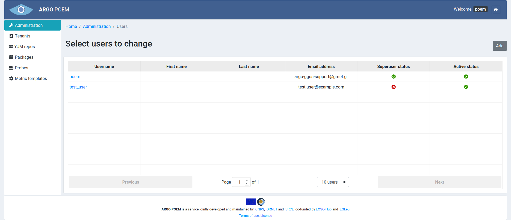
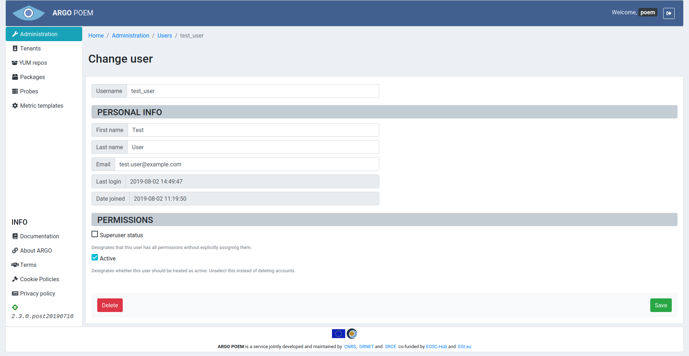
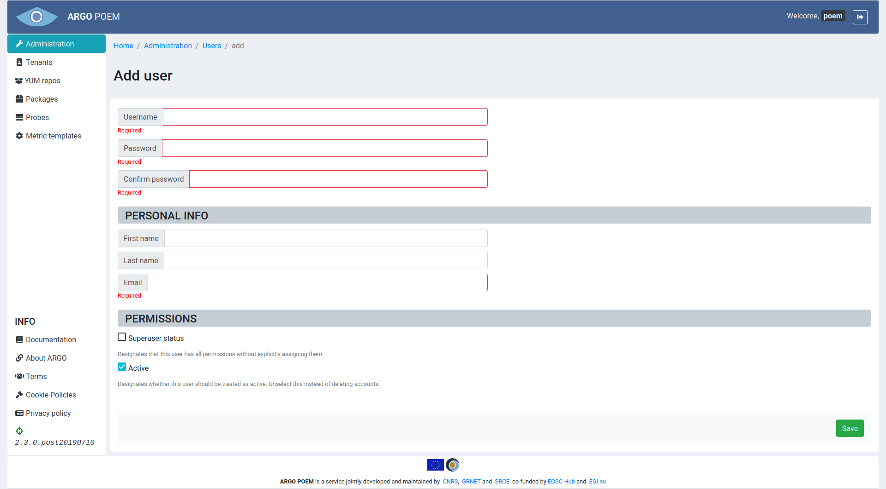

# Users

## List of users

Users page is only accessible through **Administration** page. It is shown in the image below.

## User details

By clicking user's name, one can access its details, shown in the image below.

The first field, **Username** is mandatory. It must fulfill the following conditions:

* must be 30 characters or fewer,
* can contain letters, numbers and @/./+/-/_ characters.

When adding a new user (shown in the image below), there are two more mandatory fields (**Password** and **Confirm password**):
* **Password**:
    * must contain at least 8 characters,
    * cannot be entirely numeric,
    * Must match **Confirm password** field.

### Personal info section
**Personal info** section contains three self-explanatory fields:

* **First name**,
* **Last name**,
* **Email** - mandatory field.

### Permissions section

There are two checkboxes in Permissions section. First checkbox sets superuser status - only users with this permission can access Administration page and make changes to users. By removing Active status from user, that user is no longer able to log in to POEM.
