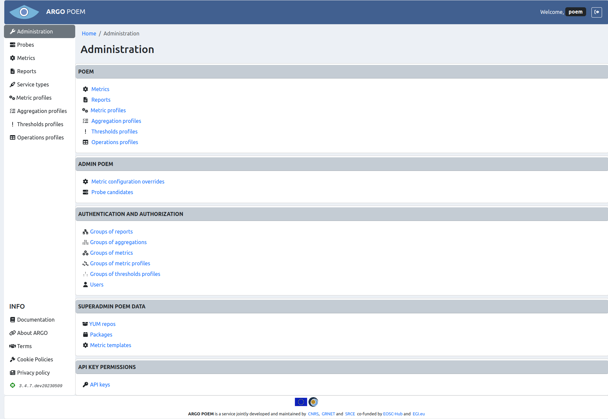

# Administration

Tenant POEM administration page is shown in the image below.

## Sections

### POEM

First section are links to component pages users are allowed to modify. They are all also accessible from the menu of the left side.

### Admin POEM

This section contains links to resources which can be viewed and modified only by the admins: [metric configuration overrides](tenant_metric_overrides.md) and [probe candidates](tenant_probe_candidates.md) - that is why those link do not exist in the side menu. 

### Authentication and authorization

Third section contains links to pages with resources related to authentication and authorization ([groups of resources](tenant_groups_of_resources.md) and [users](tenant_users.md)). For understandable reasons, it is also only available to the admins. 

### SuperAdmin POEM data

Fourth section, **SuperAdmin POEM data**, are pages of read-only resources. They are set up through SuperAdmin POEM UI, and tenant users are not allowed to modify them. 

Metric template and YUM repos pages are merely read-only pages in which the users may see the resources' configurations. [Package](tenant_packages.md) page is somewhat more elaborate. In it users can change versions of packages they use, and metrics will be automatically updated to use the probes provided by the chosen package version.

### APIKey Permissions

In fifth section, **APIKey Permissions**, users are able to see [API keys](tenant_apikey.md) for tenant.
