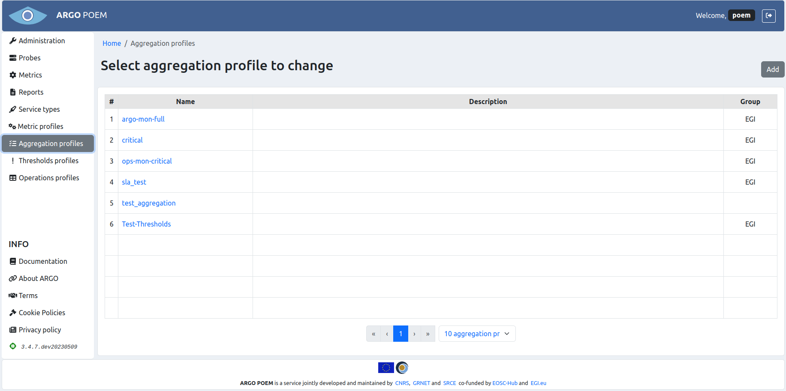
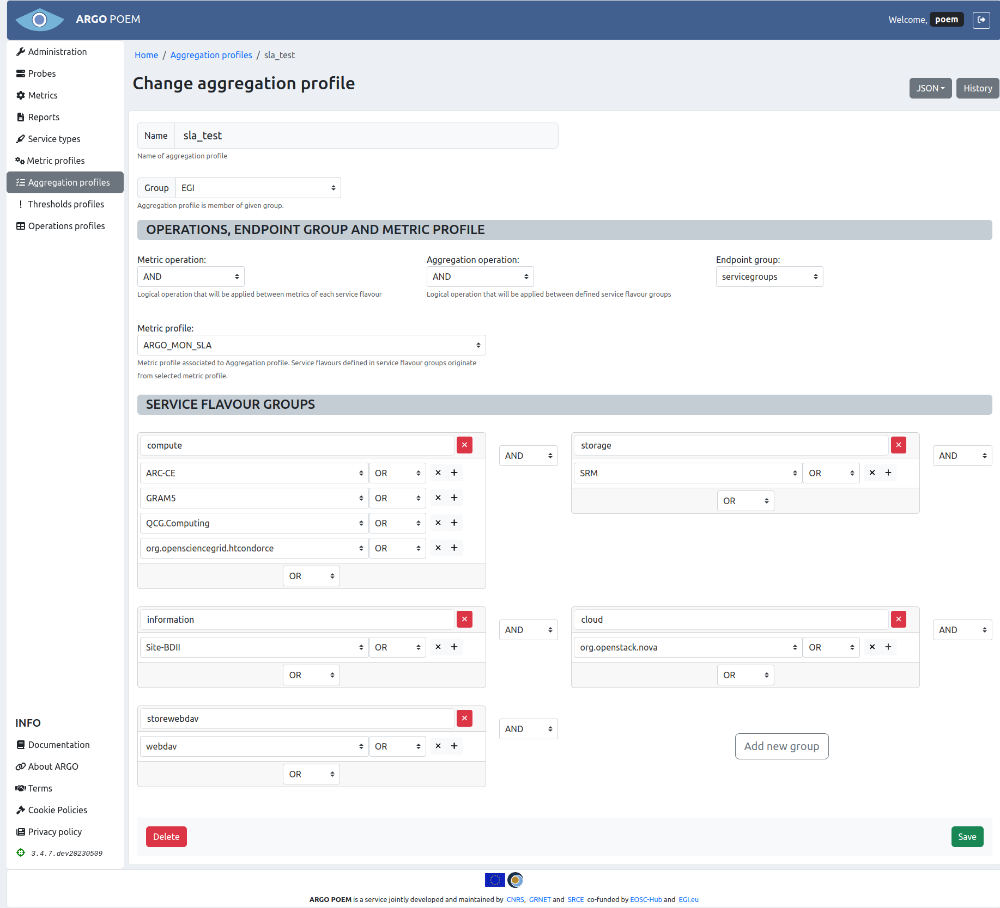
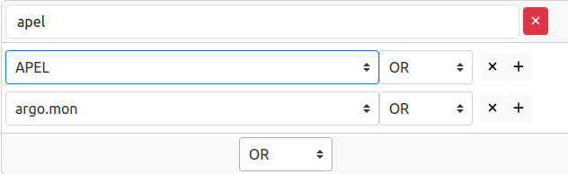

# Aggregation profiles

## List of aggregation profiles

Aggregations profiles page is accessible from the menu on the left side. It is shown in the image below.

## Aggregation profile details

By clicking the profile name, the page of that particular profile is opened. Example is shown in the image below.

### Sections

The first part is the same for all the profiles: **Name** and **Group** fields. **Group** field is a mandatory dropdown select field, so the group of aggregations must be created beforehand.

#### Operations, endpoint group and metric profile

Fields **Operations**, **Endpoint group** and **Metric profile** are all dropdown select fields. The user can choose among the existing metric profiles. 

#### Service flavour groups

In **Service flavour groups** section, the user can create new groups, and delete and modify the existing ones. For adding one uses buttons with `+` sign, for deleting buttons with `x` sign. Whole group is deleted by clicking the red `x` button.

There is a validation which checks if service flavours mentioned in aggregation profile exist in the associated metric profile. If they do not, the warning message is displayed on top of the page, as shown in the figure below. 

In case of discrepancies, at the same time with the warning message on top of the page, the missing service flavours are marked blue (like shown in the figure below).

Same as for other resources, only users with appropriate permission may modify aggregation profile. That is, users that have group of aggregation the profile belongs to assigned to them, or users with superuser permission.

### Import/Export JSON

There is a feature of importing and exporting aggregation profile data in a JSON file. Data being exported (or imported) includes sections **Operations, endpoint group and metric profile** and **Service flavor groups**.

When exporting data, user clicks on `JSON` button, and selects `Export`. The file is saved as JSON with the name of the aggregation profile being exported (in this case, the name of the file would be `sla_test.json`).

On the other hand, when importing data, user clicks on `JSON` button and selects `Import`. The data in the sections *Operations, endpoint group and metric profile* and *Service flavour groups* are then overridden by the data in the file being imported.

### Aggregation profile history

By clicking **History** button, user can see the changes made to the profile, the time they were made, and by whom they were made.
