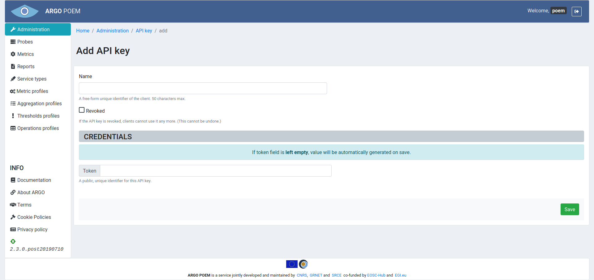

# API key

## List of API keys

API key page is available only to the users with superuser permissions, and it is accessible through [Administration page](tenant_administration.md). It is shown in the image below.

## API key's details

By clicking API key's name, one can access its details page, shown in the image below. User may revoke the key, in which case it will not be able to be used for authentication. There is also a green button which copies the token to the clipboard.

## Adding a new API key

When adding a new key, user may choose between letting the token be generated by the system, or (s)he may save the predefined token.

