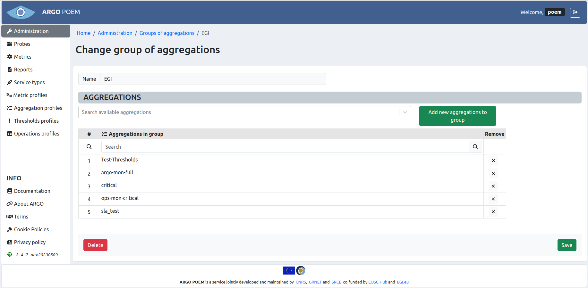
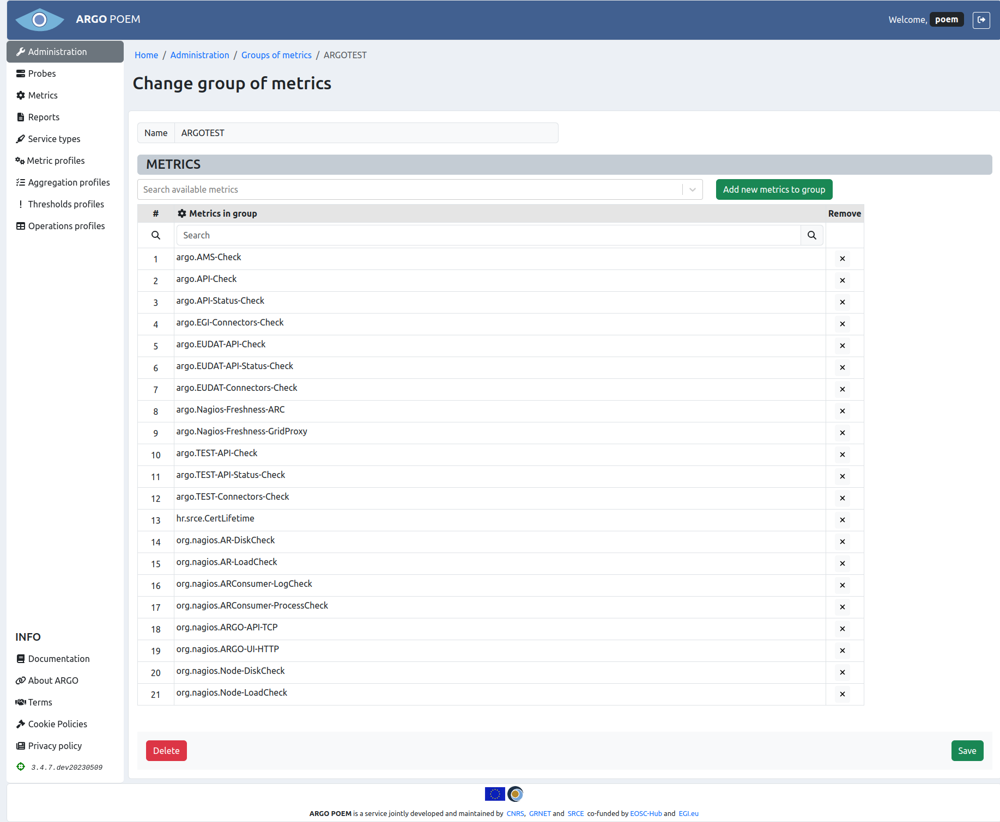
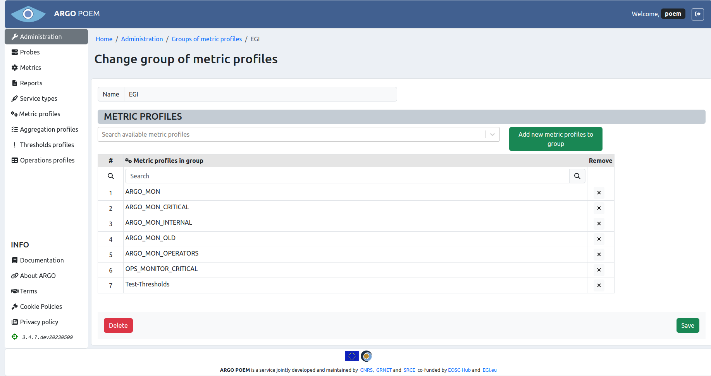

# Groups of resources

All the groups of resources are available through [Administration](tenant_administration.md) page. There are five groups of resources:

* groups of reports,
* groups of aggregations,
* groups of metrics,
* groups of metric profiles,
* groups of thresholds profiles.

All the groups of resources pages look similar. By clicking the name of group, user opens page with details of that particular group of resource.

Images of groups of resources are shown below in respective sections.

## Group of reports

## Group of aggregations

## Group of metrics

## Group of metric profiles

## Group of thresholds profiles

## Sections

All the groups of resources are organized in the same manner. There are two sections. In the first section, group's name is defined. It should be noted that once the name has been defined, it is no longer possible to change it.

In second section there is a table of resources associated with the particular group. There is also a multiple select field, where user can search for a resource with no group assigned and assign it to the particular group. User may select multiple resources, and by clicking the green button, they are added to the table below.
