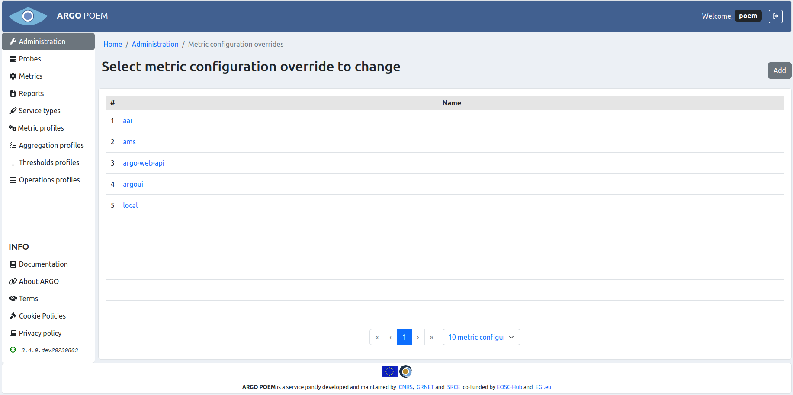
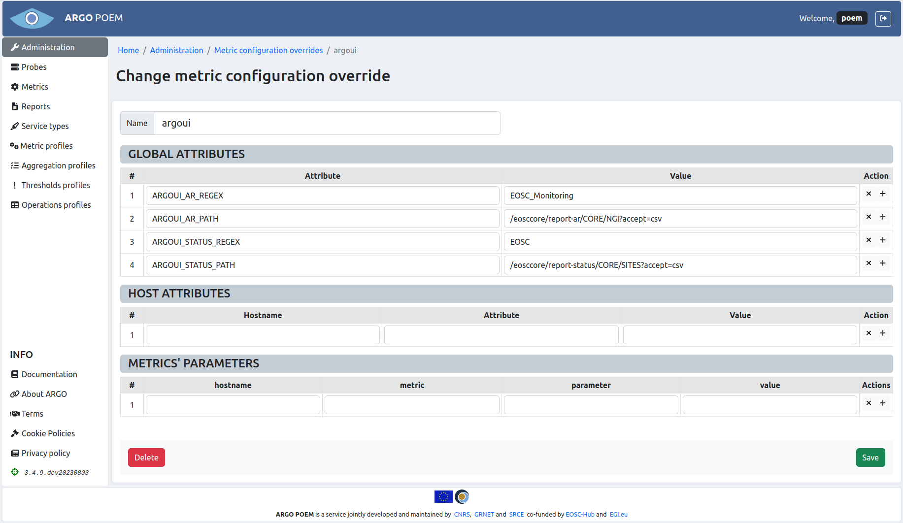

# Metric configuration overrides

This page contains overrides for metrics, which might include attribute or parameter overrides. Overrides may be stored separately for better organization. It does not make a difference when the overrides are being configured on the mon boxes. The layout of the page is shown in the figure below.

In this particular example, the overrides are stored in five separate configurations, grouped by service type for convenience.

Clicking on the name opens separate page where the configurations may be changed.

## Metric configuration overrides details

The layout of the page is shown in the figure below. The page is separated in four sections. On top of the page, there is the name of configuration, which may be changed.

Second section contains overrides of global attributes. The overrides for attributes in this section are for the entire monitoring box.

The third section, `Host attributes`, contains the attributes which are overridden only for the particular hostnames. 

In the last section, `Metrics' parameters`, one may override metric parameters per hostname per metric. All the overrides defined here are taken into account when configuring the monitoring box.

Keep in mind that secret information, such as usernames and passwords, **should not** be stored here. Such information is stored in files on the servers, and that is assumed by the tool that configures the monitoring box.
