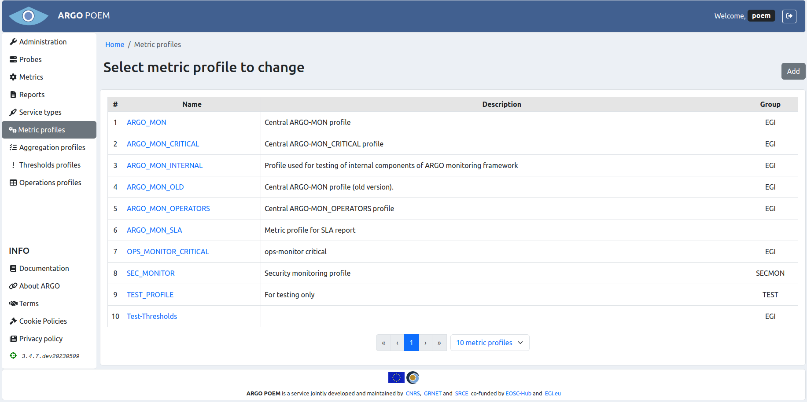

# Metric profiles

## List of metric profiles

Metric profiles page is shown in the image below. It is accessible from the menu on the left side.

## Metric profile details

By clicking the profile name, user can see the particular profile's details (shown in the image below).

### Sections

In the upper part of the page, there are **Name** and **Group** fields. Every profile must be assigned to a group, which means the group should be created beforehand.

#### Metric instances

In the **Metric instances** section, user may add new, or delete the existing service type - metric pairs. New empty fields are created by clicking the button with "+" sign, and by clicking "x" next to the service type - metric pair, that pair is removed from the metric profile. All the fields are autocomplete, so when the user starts typing, existing service types/metrics are suggested.

Same as for other resources, only users with appropriate permission may modify metric profile. That is, users that have metric group the profile belongs to assigned to them, or users with superuser permission.

### Metric profile history

By clicking the **History** button, the user can see all the changes made to the profile, when they were made and by whom (image below).

