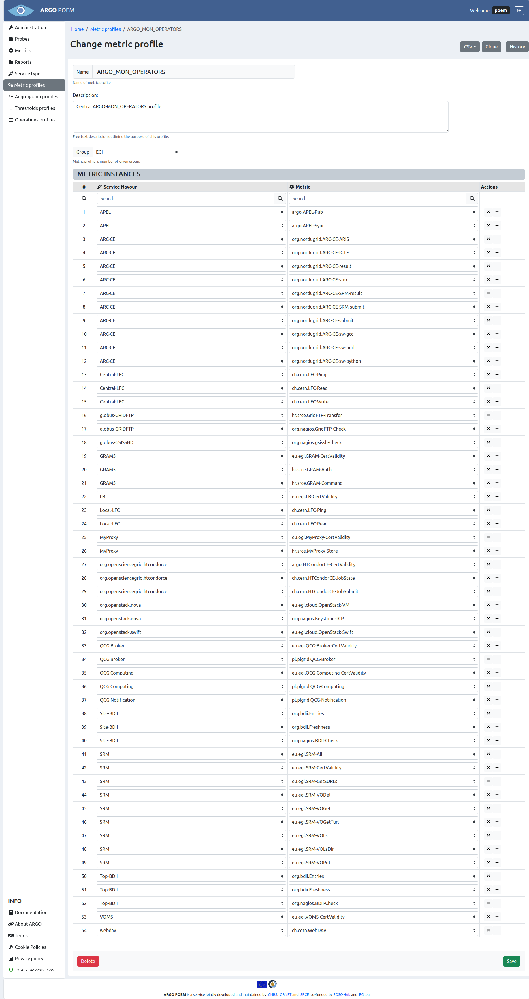

# Metric profiles

## List of metric profiles

Metric profiles page is shown in the image below. It is accessible from the menu on the left side.

## Metric profile details

By clicking the profile name, user can see the particular profile's details (shown in the image below).

### Sections

In the upper part of the page, there are **Name**, **Description** and **Group** fields. Every profile must be assigned to a group, which means the group should be created beforehand. **Name** and **Group** fields are mandatory while **Description** field is arbitrary.

#### Metric instances

In the **Metric instances** section, user may add new, or delete the existing service type - metric pairs. New empty fields are created by clicking the button with "+" sign, and by clicking "x" next to the service type - metric pair, that pair is removed from the metric profile. All the fields are autocomplete, so when the user starts typing, existing service types/metrics are suggested.

Service type - metric pairs should be filled with some values and neither of them can be left empty:

Also, duplicated pairs are not allowed and validation of form will forbid them:

For easy tracking of changes that have been made in existing profile, borders of service type - metric pairs are colored differently. Newly added pairs are always in green border while changed part (either service type or metric or both) of pair is in red border:

Same as for other resources, only users with appropriate permission may modify metric profile. That is, users that have metric group the profile belongs to assigned to them, or users with superuser permission.

### Metric profile history

By clicking the **History** button, the user can see all the changes made to the profile, when they were made and by whom (image below).

