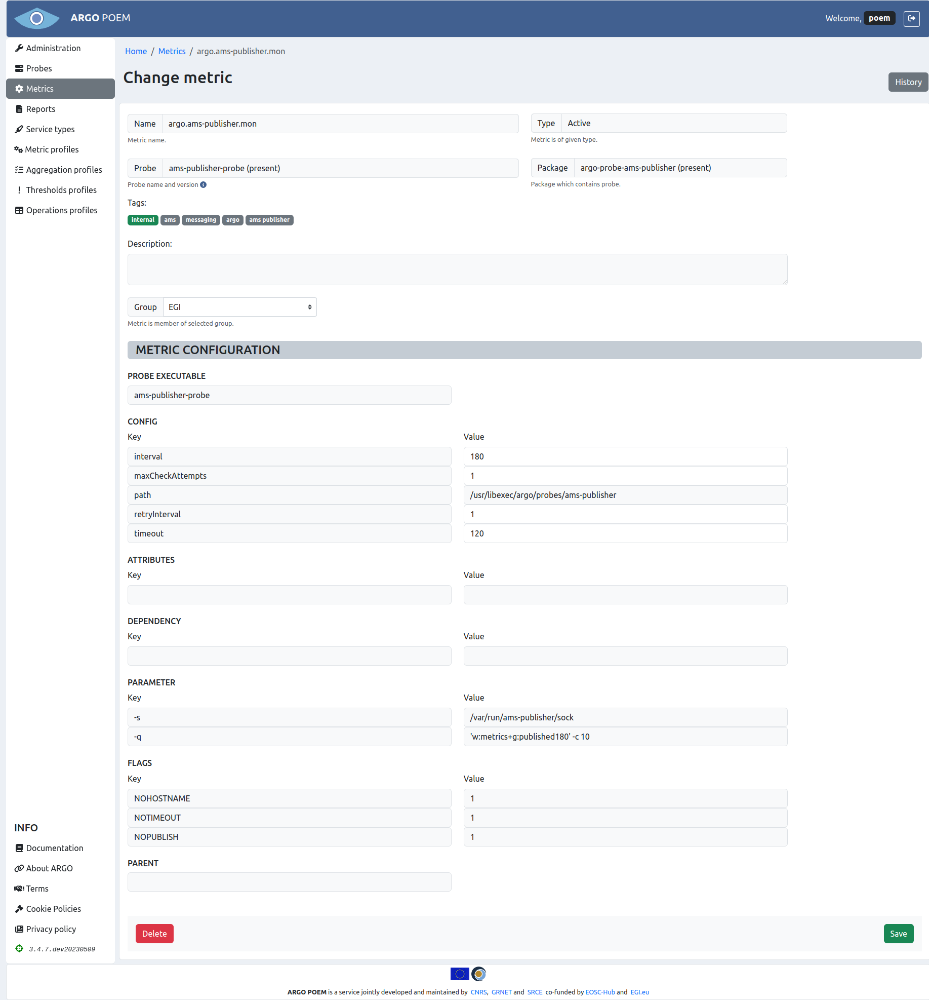
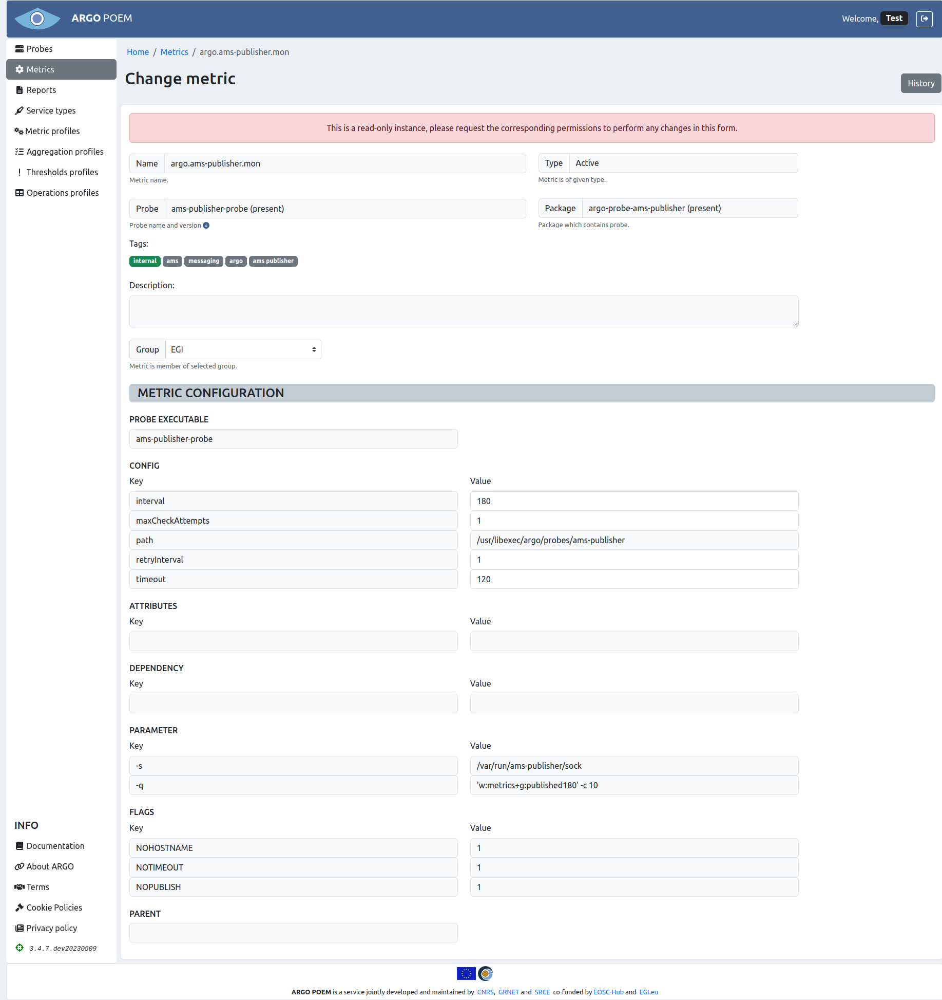

# Metrics

Metric is a procedure which checks specific functionality of a given service, i.e. single measurement (e.g. `org.nagios.WebCheck`, `hr.srce.CertLifetime`). 

Since tenant users are not allowed to create metrics themselves, metric templates are created on SuperAdmin POEM which can be imported by tenant super admins as metrics through [Metric Template Page](tenant_metric_templates.md).

## List of metrics

Metrics page is accessible through menu on the left side. It is shown in the image below.

Metrics can be filtered by name, probe, group and type (active or passive). Any particular metric can be accessed by clicking its name. Also one may see probes associated to metrics by clicking probe's name.

## Metric details

Particular metric's page is shown in the image below.

Most of the fields is disabled. Tenant users are only allowed to modify four of the configuration values and group. User may only choose among groups that are associated to him. Exception to this rule is user with superuser permission, (s)he can pick any existing group. 

Fields descriptions are given in [metric template documentation](superadmin_metric_templates.md#field-descriptions).

In case user has no permission to modify the metric, there is going to appear a warning message on top of page, as shown in image below.

### Metric history

By clicking **History** button, user can see all the changes made to the metric, when they were made, and by whom.

### Adding new metrics

Tenant users cannot add new metrics by themselves. Metrics can be imported from available metric templates by superuser on [metric template page](tenant_metric_templates.md). If none of the metric templates is satisfying, the user will have to ask a super admin to add new metric template to SuperAdmin POEM.
