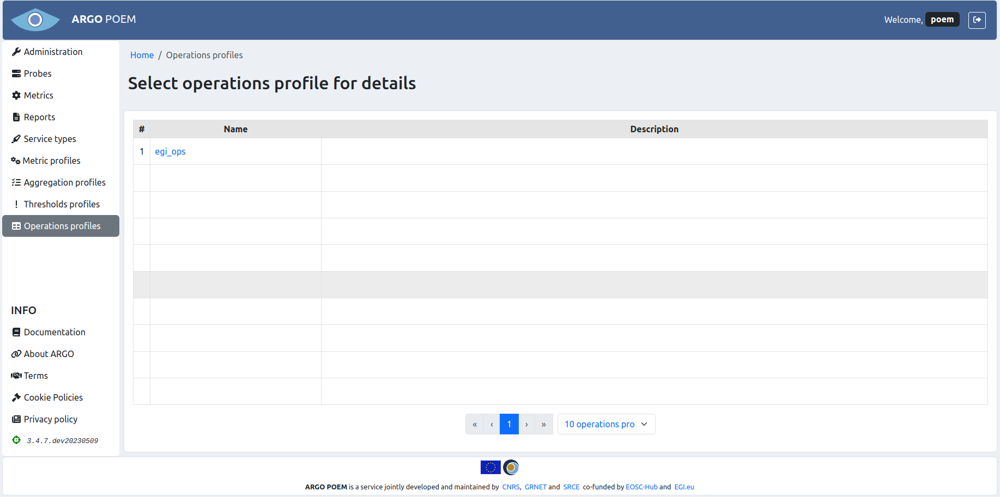
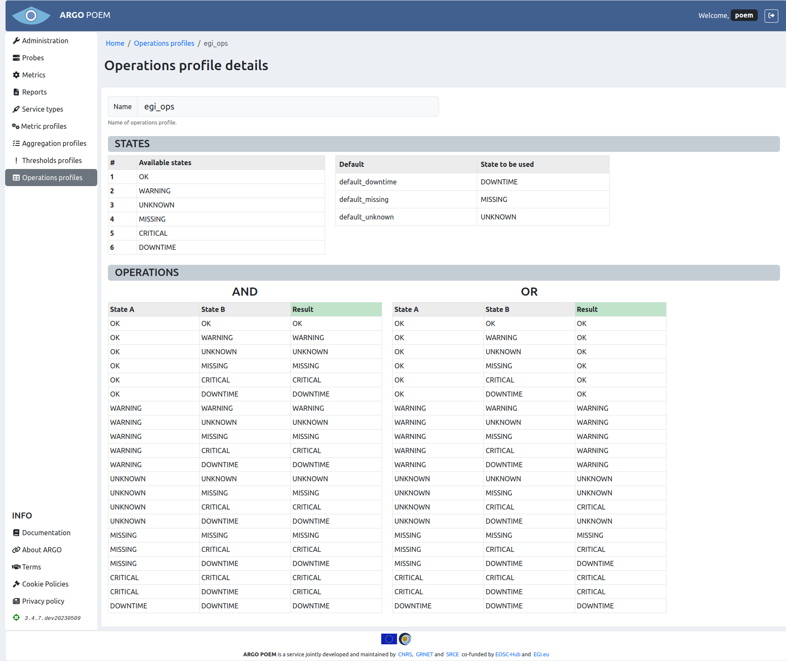

# Operations profiles

## List of operations profiles

Operations profiles page is shown in the image below. It is accessible from the menu on the left side.

## Operations profile details

By clicking the profiles name, user can see its details (shown in the image below).

The page is read only. Beside the name of the profile, there are two sections: *states* and *operations*.

In *state* section, there are two tables. One shows available status states produces by the Monitoring Engine(s), and the other one shows default states. 

Default states are necessary since compute engine gives the ability to define completely custom states based on tenants monitoring infrastructure output. Therefore, some custom states must be tagged with specific meaning. These states might not be present in the monitoring messages, but are produced during computations by the compute engine according to a specific logic. Therefore, some of the custom status tenants declare must be "tied" to a specific default state of service.

The available operations are given in the *operations* section in two truth tables: AND and OR. Every row in table represents an operation (AND or OR) between two states and their result.
