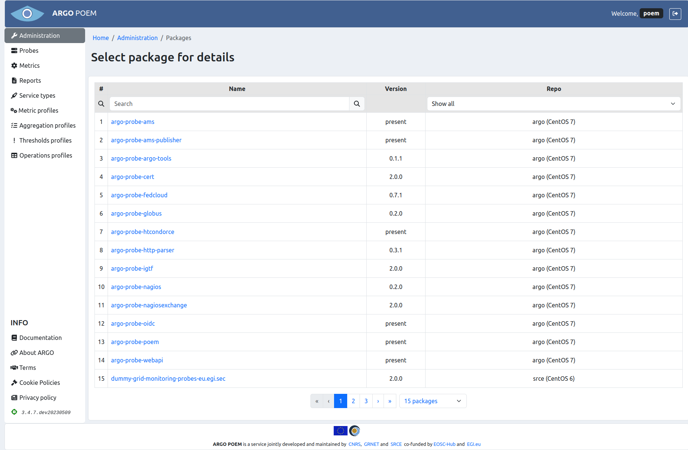

# Packages

The resource we call `packages` are configurations of `.rpm` packages which provide probes. 

## List of packages

The page shows packages that provide probes and metrics the tenant uses. The layout is shown in the figure below. It is available through [Administration page](tenant_administration.md), and as such is only available to super users. 

Packages can be filtered by name, and repo they are part of. 

## Package details

By clicking the package name, the user is redirected to package detail page. The layout is shown in the figure below. 

Tenant users are not allowed to change anything in the page. However, they have the possibility to choose which version of the package they wish to use. They do so by choosing the version in version drop down field, and clicking the **Update metrics** button. That way, metrics will automatically be updated with probes with corresponding versions. 

When user clicks the **Update metrics** button, there will be a modal dialogue which informs him/her of the changes that are going to take place and asks for confirmation (shown in the image below). 

