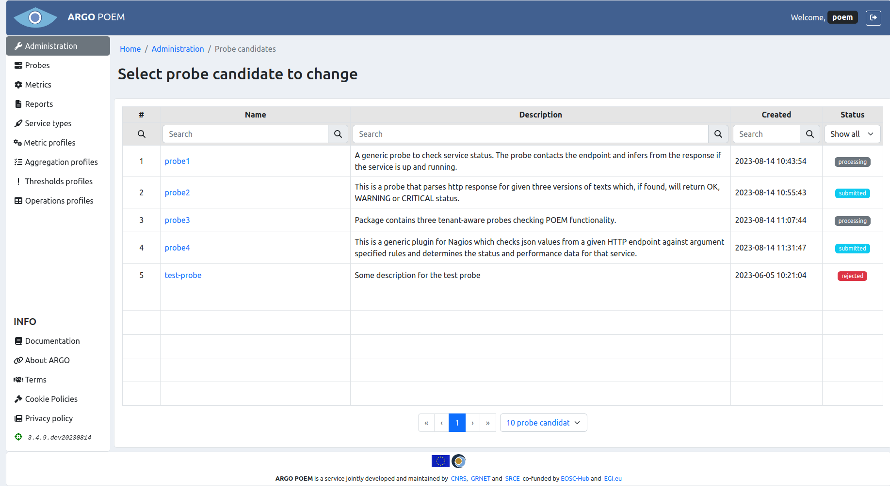
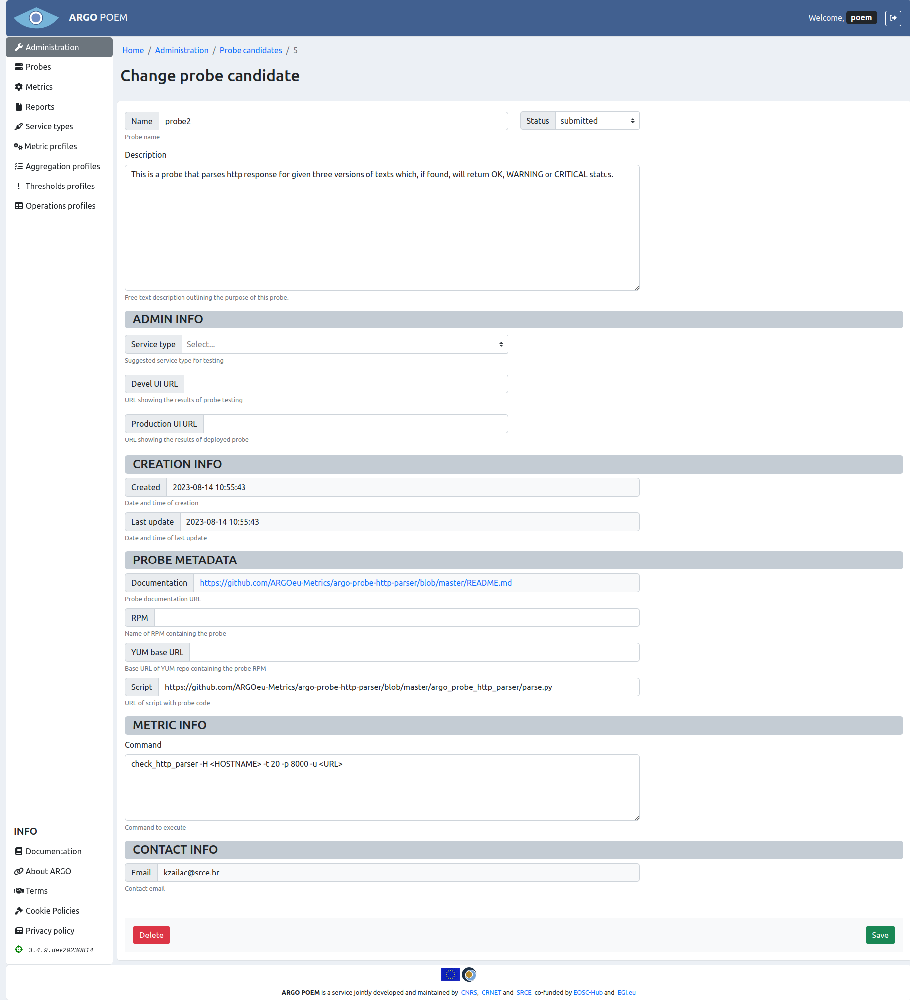

# Probe candidates

It is possible to submit a probe candidate through POEM token protected API. The submitted probe candidate is stored in a separate table in the DB, and from the information in there, POEM admins can create probes and metrics after the candidate has been reviewed and properly tested.

## API documentation

### Submitting probe candidates

Probe candidates are submitted through the token protected API in tenant POEM.

```
POST /api/v2/probes/
```

#### Request headers

```
x-api-key: token
Accept: application/json
```

#### POST body

POST body should have the following format:

```json
{
  "name": "poem-probe",
  "description": "A generic probe to check service status. The probe contacts the endpoint and infers from the response if the service is up and running.",
  "docurl": "https://github.com/ARGOeu-Metrics/argo-probe-argo-servicestatus/blob/master/README.md",
  "rpm": "argo-probe-argo-servicestatus-0.2.0-1.el7.noarch.rpm",
  "yum_baseurl": "http://rpm-repo.argo.grnet.gr/ARGO/prod/centos7/",
  "command": "/usr/libexec/argo/probes/argo-servicestatus/check_status.py -u <URL> -t 30",
  "contact": "test@example.com"
}
```


Fields `name`, `docurl`, `command` and `contact` are mandatory. Field `docurl` should be a valid URL with probe documentation, so that the monitoring team knows what the probe actually does, and the `contact` field should be a valid email address, which is going to be used to send information on the progress of probe deployment. 

The `command` field should contain the command with which to invoke the probe. The submitted probes should comply with the [guidelines for monitoring probes](https://argoeu.github.io/argo-monitoring/docs/monitoring/guidelines). If the probe is invoked with endpoint-specific values (e.g. hostname, or URL like in the example here), it is useful to use angle brackets, so that it is easier for the monitoring team to understand that this is the endpoint-specific value. If there are any uncertainties, the monitoring team will contact the submitter using the email address provided in the `contact` field.

Instead of providing the `.rpm` package and YUM repo base URL, users may also provide a script with the tests, and the monitoring team will create a proper package. In that case, the POST data must have the following format:

```json
{
  "name": "poem-probe",
  "description": "A generic probe to check service status. The probe contacts the endpoint and infers from the response if the service is up and running.",
  "docurl": "https://github.com/ARGOeu-Metrics/argo-probe-argo-servicestatus/blob/master/README.md",
  "script": "https://some.url.com/script",
  "command": "check_status.py -u <URL> -t 30",
  "contact": "test@example.com"
}
```

It is mandatory to provide either `script` field, or `rpm` and `yum_baseurl` field. It is also possible to provide only an `.rpm` package, in which case the `rpm` field **must** be a valid URL.

After successful submit of the probe candidate, the submitter will receive an email with the confirmation to the email address provided in the `contact` field. 

### Steps to probe deployment

#### Submitting

The first step is obviously submitting the probe to tenant POEM. After the probe candidate has been successfully submitted, the monitoring team is notified.

#### Processing

The monitoring team will review the submitted probe, make the necessary configurations in POEM, prepare a dedicated service type, and set its status to `processing`. The submitter will then be notified about the change of status, and will be asked to create a monitoring extension associated with the created service type. This step is necessary for proper testing of the probe in devel environment.

#### Testing

When the submitter has created the monitoring extension, the probe testing can start. The monitoring team will change the status of the probe candidate to `testing`, and the submitter will be notified about the change of status. At this point, they will also be provided with the URL to the monitoring UI where they can check the status of their probe. The probe will remain in testing for at least 3 days.

#### Deployment

If the probe test has been successful (the monitoring team is happy with the probe performance in the devel environment), the probe can be moved to production. If there were not any problems, there will be no additional action required from the submitter. They will be informed of the deployment of the probe, and they will be provided with the new UI URL, this time pointing to the production status page of the probe.

#### Rejection

If during any of the steps described above the problems have been identified which could not be mitigated, the probe candidate will be rejected. The submitter will be notified about the status change, and provided with a detailed explanation.

## POEM UI documentation (only for POEM admins!)

Probe candidates page is only accessible to POEM admins from [Administration](tenant_administration.md) page. The layout is shown in the figure below. One can see probe candidate names, descriptions, date of creation and statuses. There are five available statuses: `submitted`, `processing`, `testing`, `deployed`, and `rejected`.



By clicking the probe candidate name, one can access its change view.

### Probe candidate change view

The layout of the page is shown in the figure below.



The first section contains the very basic information on the probe: name, description (which are self-explanatory), and status (statuses are explained in section [Steps to probe deployment](#steps-to-probe-deployment)). For each newly submitted probe candidate, status is automatically set to `submitted`.

If the probe candidate status is set to `rejected`, a new field `Reason for rejection` appears in this section, which is then mandatory to populate, because the submitter receives an email containing that explanation.

Second section, **Admin info**, contains information added by the admins in process of probe deployment. Field `Service type` is a dropdown field with options covering the available service type in tenant POEM. The `Service type` field is mandatory when changing the probe candidate status to `processing`, because at that point the submitter receives an email instructing them to create a monitoring extension associated with the set service type. This is used for setting up the metric and aggregation profiles, and starting the monitoring in the devel instance.

The `Devel UI URL` field is mandatory when changing the probe candidate status to `testing`. Then, the submitter receives an email informing them that the testing has started, and providing them with the said URL to monitor the status of the submitted probe.

`Production UI URL` field is the last one to set, mandatory when the probe candidate status is changed to `deployed`, when the submitter receives an email informing them about the successful deployment of the probe, and the URL to check the probe status.

The third section, **Creation info**, contains two readonly fields, date and time of creation of probe candidate, and date and time of last update of the probe candidate.

The fourth section, **Probe metadata** contains information on the probe itself: documentation URL, name of .rpm package, YUM base URL and script URL (which are not all populated, depending on which source was submitted).

**Metric info** field contains the command field from the submitted probe, and the last section, **Contact info** contains only readonly field with contact email.
