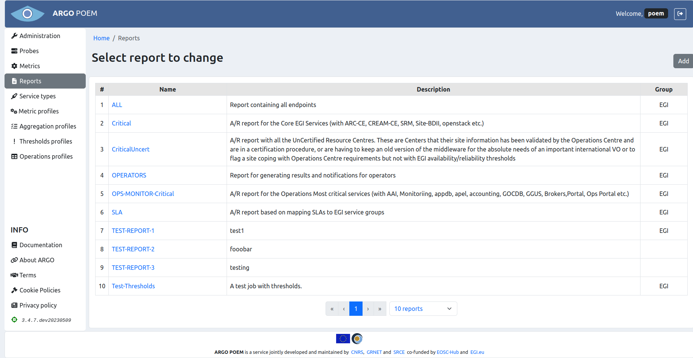
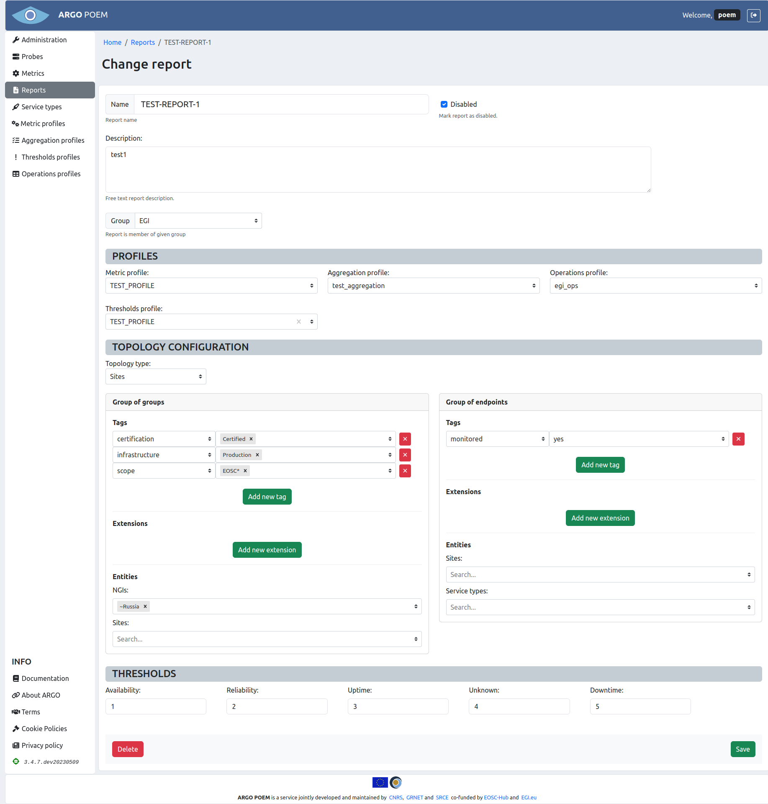

# Reports

## List of reports

Reports page is accessible from the menu on the left side and is shown in the image below. 

The table lists report name, short description and the group the report is associated to. 

## Reports details

By clicking the report's name, user can access reports change page (shown in the image below). 

### Sections

The first part of the page contains basic information on the chosen report, which includes **Name**, **Description**, and **Group** of reports it belongs to.

#### Profiles

In the **Profiles** section, user may select metric, aggregation, operations, and thresholds profiles used in creation of the chosen report. All the profiles are chosen on dropdown menus. Thresholds profile is not mandatory, while all the others are.

#### Topology configuration

In **Topology configuration** section users may choose two types of topology from the dropdown menu: *Sites* and *Service groups*. The topology is described in detail in the [official documentation](https://argoeu.github.io/argo-monitoring/docs/information_feeds/topology).

Furthermore, users may pick topology filters they want to use in the given report for two groups: *Group of groups* and *Group of endpoints*. In *Group of groups*, users have the option to filter by tags, extensions, and entities. In *Group of endpoints* one can filter by tags and extensions.

Note that entries in filters may be created with wildcard specification, and also it is possible to use `~` as negation operator to exclude something.

#### Thresholds

In the **Thresholds** section, users may set thresholds according to their wishes.
