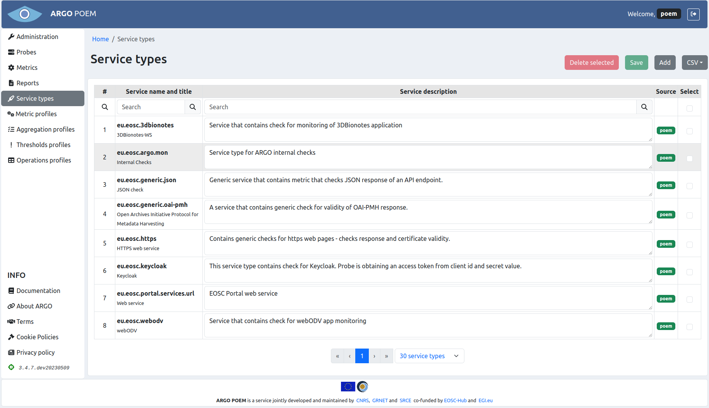

# Service types

Service types page is accessible from the menu on the left side. The data is presented in a table, with information on the name of service type, service description, its source (either topology or POEM), and a checkbox column used for deletion of service types.

Service type can be defined as part of the topology (`topology` source tag), or it can be defined in this page (`POEM` source tag). Note that the description for the service types defined in the topology cannot be modified, while the same field for service types defined through POEM can be modified. If modified, it is necessary to click the `Save` button in order to save the changes to ARGO Web-API.

The page layout is shown in the figure below. Service types can be searched by name, or by description.

Some tenants may have also service type titles defined. In that case, they are shown under the service type name in the first column, as is shown in figure below.

## Adding service types

Service types can be bulk added by clicking on the `Add` button. It opens a new page shown in the figure below. Users add service name and description in the top fields, and by clicking the `Add new` button, add them to the table below. Descriptions can be conveniently edited in the table as well. The changes are sent to the ARGO Web API by clicking the button `Save`. Service types added this way are always stored with `POEM` source tag.

In case the tenant is using service types' titles as well, the form has one additional field for the title, as shown in figure below. The saving of service type is the same as in case without the titles.

## Deleting service types

Service types may be deleted by clicking in the `Checked` column of the row(s) of the service type(s) you wish to delete, and finally clicking on the `Delete selected` button. 

Keep in mind that the service types which are defined in the topology will be restored when ARGO Web-API is synced with the topology source. Service types defined in the topology should be removed at the source, if they need to be removed.
