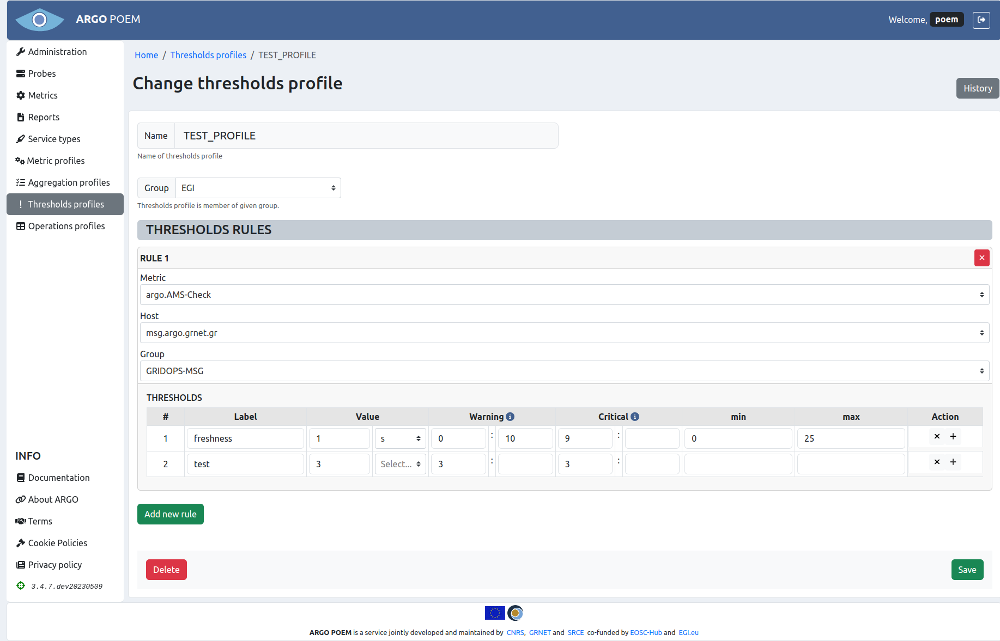

# Thresholds profiles

## List of thresholds profiles

Thresholds profiles page is accessible through the menu on the left side. It is shown in the image below.

## Thresholds profile details

By clicking on profile's name, user can access the particular profile's details (shown in the image below).

### Sections

The first part is the same for all the profiles: `Name` and `Group` fields. Profile name cannot be changed (therefore the field is disabled). `Group` field is a dropdown select field and the user can choose among the existing groups. Since the field is required, there should be at least one group of thresholds profiles created beforehand.

#### Thresholds Rules

In section **Thresholds Rules** user can add new rules. `Metric` field is required. `Host` and `Group` fields are both dropdown fields, and have predefined values depending on the chosen metric. 

In defining the thresholds, `Label`, `Warning` and `Critical` fields are required. If `Value` field has not been defined, it defaults to 0. By hovering over blue info symbol, user can see the information on how to define warning and critical ranges. Thresholds may be added by clicking the button with `+` symbol, and existing thresholds may be removed by clicking button with `x` symbol next to them. If the user wants to remove whole rule, it can be done by clicking the red button with `x` symbol.

### Thresholds Profiles History

By clicking `History` button, user can see the changes made to the profile, the time they were made, and by whom they were made.
