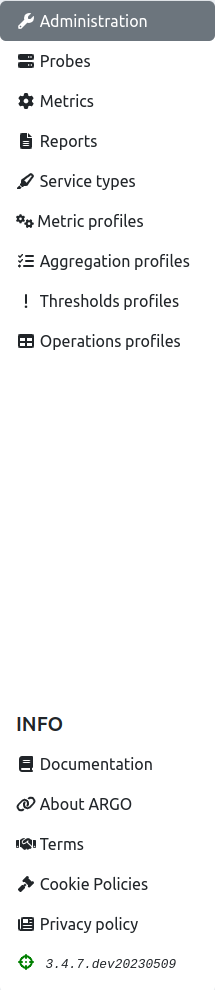
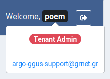
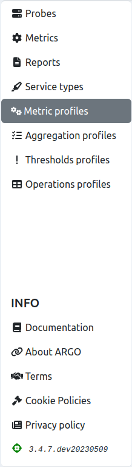
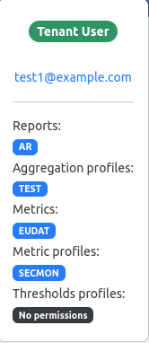

# User interface

User interface is slightly different for tenant user and tenant admin user.

## Tenant admin user

When tenant admin user (for tenant POEM, not to be mistaken for super admin user for SuperAdmin POEM) logs into POEM, (s)he is redirected to [administration page](tenant_administration.md).

On the side bar (shown in the figure below), one may access the other POEM pages: [probes](tenant_probes.md), [metrics](tenant_metrics.md), [metric profiles](tenant_metric_profiles.md), [aggregation profiles](tenant_aggregation_profiles.md), [thresholds profiles](tenant_thresholds_profiles.md), and [operations profiles](tenant_operations_profiles.md).

On the top bar (shown in the figure below), there are ARGO logo, welcome message for user, and logout button.

By hovering over his/her name, user may see his/her details: user type (tenant user, or tenant admin user), and his/her email address.

## Tenant user

Tenant users do not have permission to access [administration page](tenant_administration.md), so when they are logged in, they are redirected to [metric profiles page](tenant_metric_profiles.md).

The sidebar for tenant users (shown in the figure below) is, therefore, somewhat shorter: it does not contain link to administration, just to [probes](tenant_probes.md), [metrics](tenant_metrics.md), [metric profiles](tenant_metric_profiles.md), [aggregation profiles](tenant_aggregation_profiles.md), [thresholds profiles](tenant_thresholds_profiles.md), and [operations profiles](tenant_operations_profiles.md).

Top bar looks the same as for admin user. The difference is in hover info. When the user hovers over his/her name, the info shown (figure below) is: user type (tenant user, or tenant admin), groups of resources associated to him/her, and his/her email address.

In this example, the user is assigned `TEST` group of aggregations, `EUDAT` group of metrics, `SECMON` group of metric profiles, and none of the groups of thresholds profiles.
